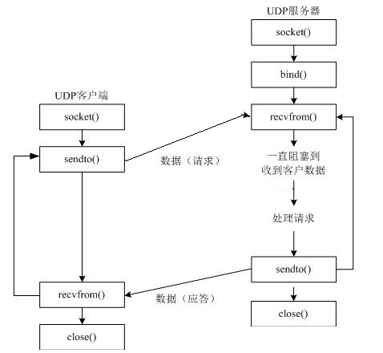

并发网络编程
==========================

| Tedu Python 教学部 |
| --- |
| Author：吕泽|

-----------

[TOC]

## 1. 网络编程

### 1.1 网络基础知识


#### 1.1.1 什么是网络

* 什么是网络 : 计算机网络功能主要包括实现资源共享，实现**数据信息的快速传递**。

  

  

<!--**路由器连接互联网，没有路由器上不了网**-->

<!--**交换机连接局域网**-->

<!--**MAC 设备地址 硬件设备识别号**-->

<!--**IP地址 网络标识**-->

<!--**DNS   得到域名对应IP地址的过程 叫做域名解析**-->

<!--URL 统一资源定位系统-->


#### 1.1.2 网络通信标准

* 面临问题

  1. 不同的国家和公司都建立自己的通信标准不利于网络互连
  2. 多种标准并行情况下不利于技术的发展融合

  


* OSI 7层模型  <!--ISO制定的网络通信标准7层模型-->   *****************

  

  * <!--5、6、7应用工程师，4系统提供 1-3通信工程 网络运维工程 网络硬件工程师-->

  * 1.应用层：编写各种功能的应用软件，实现应用具体功能，是实现网络第一环节 wechat weibo

  * 2.表示层：数据的格式化、加密、压缩优化作用（其他应用截获后为乱码，压缩空间小）

  * 3.会话层：建立应用级的连接（客户端打开与服务端自动连接），并为应用**选择适当的传输服务**（数据形式（文字、视频）在不断发生变化，根据数据需求不同传输服务不同）

  * 4.传输层：提供端对端传输服务，只有两种传输服务，应用工程师应会选择具体的传输层

  * 5.网络层：网络设备完成的，逻辑寻址，路由选择（经过无数的网络设备-网络节点，路由器，移动设备）

  * 6.数据链路层：将消息必须转换成二进制，并且分组发送出去，分组封装后的单位叫做帧（丢帧，丢包-不清晰）

  * 7.物理层：物理设备，网线，网卡，网络接口

    <!--应用工程师，要知道7层模型及相应的功能，不需要知道如何实现功能-->

  * **好处**

    1. 建立了统一的通信标准   
    2. 降低开发难度，每层功能明确，各司其职  <!--高内聚，每个模块只做好一件事,低耦合-->
    3. 七层模型实际规定了每一层的任务，该完成什么事情
  
  **面试7层模型，1.标准化通讯流程， 2.具体包括应用层 表示层 会话层 传输层 网络层 数据链路层 物理层， 3.好处/作用是什么，万物互联，耦合度低   4. 引申，工作中过于严谨繁琐  5.我用它做什么，TCP/IP网络工程**
  
* TCP/IP模型    <!--OSI7层模型实际工作中演化成TCP/IP-->

  * 七层模型过于理想，结构细节太复杂
  * 在工程中应用实践难度大
  * 实际工作中以TCP/IP模型为工作标准流程
  * <!--应用层 表示层 会话层合并成应用层，因为功能为开发单位的核心功能-->
  * <!--因数据链路转化往往是在物理设备中完成的，所以两者合并成网络接口-->
  * <!--TCP/IP命名取决于两个协议-->
  * <!--TCP/IP的每一层规定需要完成的功能，但是不规定如何实现功能，因为每个应用功能不同-->   
  * <!-- HTTP：网页浏览，SMTP:发送邮件，FTP：发送文件-->

  
         

* 网络协议

  * 什么是网络协议：在网络数据传输中，都遵循的执行规则。
  * 网络协议实际上规定了每一层在完成自己的任务时应该遵循什么规范。
  * <!--所谓的网络协议就是指在完成具体功能时遵循的通讯规则，通讯方案-->
  * <!--名协议适用多种功能TCP/IP协议族/集，公司所做的网络协议只针对公司产品设计-->


* 需要应用工程师做的工作 ： 编写应用功能，明确对方地址，选择传输服务。

  
    * <!--编写应用功能：写信的内容 -> 明确对方地址（网络地址）-> 选择传输服务(中国移动)   ->中国移动+华为传输 ->接收查看 -->  
    * <!--应用功能：需要多种技术的集成 长期积累-->
    * <!--对方地址：传输到某一台计算机，如何确定网络地址？-->
    
    

#### 1.1.3  通信地址


* IP地址

  * IP地址 ： 即在网络中标识一台计算机的地址编号。  <!--能上网的设备都称为网络设备-->

  * IP地址分类 <!--两类-->

    * IPv4 ： 192.168.1.5      <!--四组，每组一个数字0-255，总数256**4->2**32-->

                                              <!--分类为企业使用，个人用，试验用-->

    * IPv6 ：fe80::80a:76cf:ab11:2d73  <!--（2**4*4）**8 -> 2**128 -->

  * IPv4 特点

    * 分为4个部分，每部分是一个整数，取值分为0-255

  * IPv6 特点（了解）

    * 分为8个部分，每部分4个16进制数，如果出现连续的数字 0 则可以用 ：：省略中间的0

  * IP地址相关命令

    * ifconfig : 查看Linux系统下计算机的IP地址

      

    * ping  [ip]：查看计算机的连通性        <!--虚拟机桥接模式-->  CRTL+C结束

      * <!--网址：给百度的IP地址起了个名字，域名为了方便好记，IP也可以访问-->

    * nslookup www.baidu.com

      

  * 公网IP和内网IP

    * 公网IP指的是连接到互联网上的公共IP地址，大家都可以访问。（将来进公司，公司会申请公网IP作为网络项目的被访问地址）<!--公网IP可以被内网IP访问，公网IP也可以访问内网IP，公网IP不会重复-->
    * 内网IP指的是一个局域网络范围内由网络设备分配的IP地址。 <!--同一局域网内IP可以相互访问;内网IP不能够被其他内网IP访问，不能够被主动访问;不同内网IP地址有可能重复-->
    * 
    
    <!--宝强家三台设备可以相互访问, 老宋家设备不能直接访问宝强家设备,-->
    
    <!--1.1.1.6与1.1.1.7由供应商分配的,网络寻址是逐级查找,先找1.1.1.6再找192.168.1.3-->
    
    <!-- 公网IP:微信服务程序运行在服务器上,服务器向运行商申请并经过网络映射技术生成公网IP,公网IP可以被访问,也可以访问内网IP-->
    
    <!--转发过程-发送设备-服务器转发-接收设备-->

* 端口号

  * 端口：网络地址的一部分，在一台计算机上，每个网络程序对应一个端口。<!--IP地址确定计算机,端口号确定应用程序,端口是地址的一部分,每个应用程序都有一个端口,不重复-->

    

  * 端口号特点  <!--一个数字编号，操作系统分配或向操作系统申请的，不冲突-->

    * 取值范围： 0 —— 65535 的整数 
    * 一台计算机上的网络应用所使用的端口不会重复  <!--系统分配-->
    * 通常 0——1023 的端口会被一些有名的程序或者系统服务占用，个人一般使用 > 1024的端口  <!--数据库占用3306端口, 通常使用>10000, 8888 9999 10000--> 
    * <!--系统分配微信客户端口,启动微信需要连接腾讯服务器，客户端微信自动将IP地址和端口告知服务器，服务器端程序的IP地址和端口是工程师设置的不变，只运行一个服务端程序-->

#### 1.1.4 服务端与客户端

* 服务端（Server）：服务端是为客户端服务的，服务的内容诸如向客户端提供资源，保存客户端数据，处理客户端请求等。<!--运行在服务器上，满足客户端各种请求-->

* 客户端（Client） ：也称为用户端，是指与服务端相对应，为客户提供一定应用功能的程序，我们平

* 时使用的手机或者电脑上的程序基本都是客户端程序。 <!--运行在客户端,发起请求-->

* <!--发起请求与满足请求的过程，通过网络消息实现-->

  


### 1.2 UDP 传输方法

#### 1.2.1 套接字简介  

<!--UDP与TCP均采用套接字技术,应用层网络编程技术必用-->

* 套接字(Socket) ： 实现网络编程进行数据传输的一种技术手段,网络上各种各样的网络服务大多都是基于 Socket 来完成通信的。   <!--由unix扩展到linux与windows,-->

  

* Python套接字编程模块：import  socket  / from socket import *


#### 1.2.3  UDP套接字编程

* 创建套接字      .socket本质是个类  实例化套接字对象

```python
sockfd=socket.socket(socket_family,socket_type,proto=0)
功能：创建套接字
参数：socket_family  网络地址类型 AF_INET表示ipv4  -->特殊变量 AF_INET6表示ipv6
	   socket_type    套接字类型 SOCK_DGRAM  #表示udp套接字 （也叫数据包套接字datagram） 
	   proto  通常为0  选择子协议     #应用层编程选择传输层的UDP协议 UDP/TCP无子协议
返回值： 套接字对象
```


* 绑定地址  <!--服务器端必须绑定地址，客户端也可以绑定，但通常不绑定，因端口由系统分配避免冲突-->
  * 本地地址 ： 'localhost' , '127.0.0.1'            # 'localhost' 特殊字符
  * 网络地址 ： '172.40.91.185' （通过ifconfig查看）
  * 自动获取地址： '0.0.0.0'


```python
sockfd.bind(addr)      #bind后就是两个括号(('0.0.0.0',8888)) 
功能： 绑定本机网络地址
参数： 二元元组 (ip,port)  ('0.0.0.0',8888)     #0.0.0.0 万能地址

以服务器地址绑定为例:
127.0.0.1/localhost 本机测试地址，不能通过其他计算机客户端访问该地址，只能服务端与本机客户端在同一台计算机访问,  发布时不可用,只能测试用
172.40.91.188 网络IP地址，客户端程序无论本机还是其他机器都能够通过IP地址访问
0.0.0.0 万能地址 只能用于服务器端绑定，不能用于访问,其他客户端/本机客户端通过网络IP地址或者本机客户端通过测试地址访问;  #万能地址,自动探测,IP地址变了,自动选择合适的IP,不需要改变代码
```

```
"""
套接字函数基础展示
"""
import socket

# 创建一个udp套接字
udp_socket = socket.socket(socket.AF_INET,socket.SOCK_DGRAM)   #SOCK_DGRAM代表数据报套接字，也是代表UDP套接字

# udp_socket.bind(('0.0.0.0',8888))     #就是两个括号

# udp_socket.bind(('127.0.0.1',8888))
# udp_socket.bind(('localhost',8888))

udp_socket.bind(('172.40.0.228',8888))
```


* 消息收发

```python		    
data,addr = sockfd.recvfrom(buffersize)
功能： 接收UDP消息
参数： 每次最多接收多少字节
返回值： data  接收到的内容     要求必须字节串
	      addr  消息发送方地址

n = sockfd.sendto(data,addr)
功能： 发送UDP消息
参数： data  发送的内容 bytes格式 要求必须字节串
	    addr  目标地址
返回值：发送的字节数
```

* 关闭套接字

```python
sockfd.close()
功能：关闭套接字
```

```
"""
udp_client.py  客户端
"""
from socket import *

# 服务端地址
ADDR = ("127.0.0.1",8888)

# 创建UDP套接字
udp_socket = socket(AF_INET,SOCK_DGRAM)

# 发数据
while True:
    msg = input(">>")
    udp_socket.sendto(msg.encode(),ADDR)

udp_socket.close()
```

```
"""
udp_server.py  udp服务端简单示例
"""

from socket import *

# 创建udp的套接字
udp_socket = socket(AF_INET,SOCK_DGRAM)         #3.选择传输服务

# 绑定地址
udp_socket.bind(("0.0.0.0",8888))              #2.确定地址

# 接收一个消息
while True:
    # 注意接收到的addr是客户端的地址
    data,addr = udp_socket.recvfrom(1024)      #1.编写应用功能
    print("从网络接收到了:",data.decode()) #转换为字符串

# 关闭套接字
udp_socket.close()

```

#### Day11 前情回顾

```
1. pymysql 数据库的文件存储

2. 网络基础

   什么是网络 ：   数据传输
   OSI七层模型 ： 网络标准化通信模型
   TCP/IP模型 ： 实际工作
   网络协议 ： 网络通信中双方遵守的规则
   网络地址 ： ip地址  端口号
   客户端，服务端

cookie: 面试套路
这是什么   具体描述  好处/作用是什么   引申   我用它做什么

3. udp编程

   socket()

   bind()

   sendto()
   recvfrom()

   close()
```


* 服务端客户端流程

  

- 重点代码

```python
"""
udp_server.py  udp套接字编程演示
重点代码
"""
from socket import *

# 确定服务器地址
ADDR = ('0.0.0.0',8888)

# 创建udp套接字
udp_socket = socket(AF_INET,SOCK_DGRAM)

# 绑定地址
udp_socket.bind(ADDR)

while True:
    # 接收客户端消息        #可以同时接受多个客户端的消息
    msg,addr = udp_socket.recvfrom(1024)
    # 与客户端约定了一个特殊的退出指令 服务端程序一般不退出   
    # if msg == b'##':
    #     break          #可以按红点强制退出
    print("Recv:",msg.decode())
    udp_socket.sendto(b"Thanks",addr) # 给对应客户端发送消息

udp_socket.close()

--------------------------
"""
udp套接字演示 客户端
重点代码
"""
from socket import *

# 确定服务端地址
ADDR = ('127.0.0.1',8888)

# 创建套接字
udp_socket = socket(AF_INET,SOCK_DGRAM)


# 循环发送接收消息
while True:
    msg = input(">>")
    # 空字符串执行break
    if not msg:
        break
    udp_socket.sendto(msg.encode(),ADDR)
    # 客户端结束
    # if msg == "##":
    #     break
    data,addr = udp_socket.recvfrom(1024)
    print("From server:",data.decode())

udp_socket.close()
```

```python
"""
写一个程序，使用udp。
要求，从客户端可以循环的输入单词，服务端查询到单词，讲
单词的解释发送给客户端，让客户端打印

单词通过数据表words查询

思路： 客户端输入一个单词，发送一次，然后等接收，打印
    服务端，接收单词，查询单词 将解释发送给客户端
"""
from socket import *
import pymysql

# 确定服务器地址 
ADDR = ('0.0.0.0', 8888)  #1.函数通用的变量设置成全局变量,
                          #2,具有特殊含义的变量设置成全局变量,地址是具有特殊含义的,所以设全局

# 连接数据库-》创建游标——》执行sql-》查询结果  day11 138min am
class Database:
    def __init__(self):  #创建类,实例化对象,自动执行init完成准备工作,连接数据库,创建游标对象
        self.db = pymysql.connect(user="root",
                                  password="123456",
                                  database="dict",
                                  charset="utf8")
        self.cur = self.db.cursor()

    def close(self)   #配套关闭
        self.cur.close()    #每次查询内容存储在游标内,取出一个少一个
        self.db.close()

    def find_word(self,word):   #其他方法可扩展添加
        """
        :param word: 要查询的单词
        :return: str 查询得到的解释  or Not Found
        """
        sql = "select mean from words where word=%s;"
        self.cur.execute(sql,[word])
        result = self.cur.fetchone() # (mean,) None
        if result:
            return result[0] # 返回解释
        else:
            return "Not Found"

# 单词的接收和解释发送
def main():
    # 创建udp套接字
    udp_socket = socket(AF_INET, SOCK_DGRAM)
    # 绑定地址
    udp_socket.bind(ADDR)

    db = Database()   # 生成数据库对象    类实例化对象
    while True:
        # 接收单词
        word, addr = udp_socket.recvfrom(1024)
        # 查询单词   创建类完成
        result = db.find_word(word.decode())

        udp_socket.sendto(result.encode(), addr)  # 给对应客户端发送消息
    db.close()
    udp_socket.close()


if __name__ == '__main__':
    main() # 启动


--------------------------------------------------------------------
from socket import *

# 确定服务端地址
ADDR = ('127.0.0.1',8888)

# 创建套接字
udp_socket = socket(AF_INET,SOCK_DGRAM)

# 循环发送接收消息
while True:
    # 输入单词
    word = input(">>")
    if not word:
        break
    # 发送单词
    udp_socket.sendto(word.encode(),ADDR)
    data,addr = udp_socket.recvfrom(1024)
    print("%s:%s"%(word,data.decode()))

print("退出程序")
udp_socket.close()

```


#### 1.2.4  UDP套接字特点

* 可能会出现数据丢失的情况 <!--recvfrom(5)超过5个字节就会丢失，如果估算不准就会出错,要合理估算消息大小;1个汉字3字节，数字、英文1字节-->
* 传输过程简单，实现容易
* 数据以**数据包**形式表达传输
* 数据传输效率较高

    <!--游戏主要UDP 自由奔放； 聊天 发邮件 浏览网页主要TCP 严谨可靠-->


### 1.3 TCP 传输方法

#### 1.3.1 TCP传输特点

* 面向连接的传输服务
  * 传输特征 ： 提供了可靠的数据传输，可靠性指数据传输过程中**无丢失，无失序，无差错，无重复**。
  * 可靠性保障机制（都是操作系统网络服务自动帮应用完成的）：  <!--吵架故事-->
    * 在通信前需要建立数据连接
    * 确认应答机制
    * 通信结束要正常断开连接

* 三次握手（建立连接）<!--面试问,应用端编码不需要写这个过程,通过listen,accept实现-->
  * 客户端向服务器发送消息报文请求连接   <!--特殊变量SYN,随机值sep=x-->
  * 服务器收到请求后，回复报文确定可以连接  <!--随机值x+1  随机值y-->
  * 客户端收到回复，发送最终报文连接建立    <!--随机值+1-->


					

* 四次挥手（断开连接） <!--谁先断开都可以-->
  * 主动方发送报文请求断开连接
  * 被动方收到请求后，立即回复，表示准备断开
  * 被动方准备就绪，再次发送报文表示可以断开
  * 主动方收到确定，发送最终报文完成断开


<!--TCP连接是传输层,是一种系统层面,意识上的约定,保障机制,并不是物理意义上连接.如果网线剪断了,网络接口层损坏,TCP连接则废弃.-->

#### 1.3.2 TCP服务端


<!--创建套接字-> 绑定地址-> （设置监听-> 等待处理连接)-> 收发消息-> 关闭套接字 -->

- 创建套接字   

```python
sockfd=socket.socket(socket_family,socket_type,proto=0)  #默认创建TCP 参数
功能：创建套接字
参数：socket_family  网络地址类型 AF_INET表示ipv4
	 socket_type  套接字类型 SOCK_STREAM 表示tcp套接字 （也叫流式套接字） 
	 proto  通常为0  选择子协议
返回值： 套接字对象
```

- 绑定地址 （与udp套接字相同）

```python
sockfd.bind(addr)
功能： 绑定本机网络地址
参数： 二元元组 (ip,port)  ('0.0.0.0',8888)     #0.0.0.0 万能地址
127.0.0.1 /localhost 测试地址，不能通过其他计算机访问该地址，只能客户端与服务端在同一台计算机访问
172.40.91.188 网络IP地址，客户端程序无论本机还是其他机器都能够IP地址访问
0.0.0.0 万能地址 只能用于服务器端绑定，其他客户端/本机通过网络IP地址或者本机通过测试地址访问
```

* 设置监听   <!--只有服务端需要设置监听，套接字升级后可以被客户端连接，监听客户端动作-->

```python
sockfd.listen(n)  #套接字变成监听套接字,可以建立连接,但是没有accept就处理不了
功能 ： 将套接字设置为监听套接字，确定监听队列大小
参数 ： 监听队列大小      #linux下操作系统自动设定参数,n为无效设置,win/unix下有效
```


<!--一个监听套接字可以连接1024个客户端，但是连接过程要按顺序one by one(三次握手)-->

<!--listen(n),n个可以进入队列，超过n的被拒绝，但连接速度很快，n不必设置过大占用内存-->

<!--监听套接字负责连接,监听套接字通过accept创建客户端连接套接字connfd,连接套接字与客户端专属对应-->

* 处理客户端连接请求  <!--accept阻塞函数，连接套接字与客户端建立专属对应关系-->

```python
connfd,addr = sockfd.accept() #accept处理请求,才能真正建立连接,(执行三次握手操作)
功能： 阻塞等待处理客户端请求
返回值： connfd  客户端连接套接字***  #注意传递的是客户端套接字和客户端地址
        addr  连接的客户端地址
```

<!--UDP套接字  TCP（监听）套接字 连接套接字，共三种不同套接字 调用不同方法 实现不同功能-->

* 消息收发

```python
data = connfd.recv(buffersize)    #不需要地址 已连接
功能 : 接受客户端消息
参数 ：每次最多接收消息的大小
返回值： 接收到的内容

n = connfd.send(data)            #不需要地址 已连接
功能 : 发送消息
参数 ：要发送的内容  bytes格式
返回值： 发送的字节数
```

6. 关闭套接字 (与udp套接字相同)

```
"""
tcp 服务端基础示例
"""
from socket import *

# 创建tcp套接字 (默认也是tcp)
tcp_socket = socket(AF_INET,SOCK_STREAM)

# 绑定地址
tcp_socket.bind(('0.0.0.0',8888))

# 设置监听
tcp_socket.listen(5)

# 等待处理客户端连接
print("Waiting for connect...")
connfd,addr = tcp_socket.accept()
print("Connect from,",addr) # 打印客户端地址

# 等待接收
data = connfd.recv(1024)
print("Recv:",data.decode())

# 都要关闭
connfd.close()
tcp_socket.close()
```


#### 1.3.3 TCP客户端 


* 创建TCP套接字
* 请求连接

```python
sockfd.connect(server_addr)
功能：连接服务器
参数：元组  服务器地址
```

* 收发消息

> 注意： 防止两端都阻塞，recv send要配合

* 关闭套接字

  ```python
  """
  tcp简单客户端演示   #监听套接字是让服务器被人连接,客户端是连接别人,所以不需要设置监听套接字,服务        										端与客户端是一对多的关系
  """
  from socket import *
  
  # 创建tcp套接字
  tcp_socket = socket()  #默认就是AF_INET,SOCK_STREAM,所以括号内可以为空
  
  # 发起连接 连接服务端
  tcp_socket.connect(("127.0.0.1",8888))
  
  # 发送消息
  msg = input(">>")
  tcp_socket.send(msg.encode()) # 发送字节串
  
  tcp_socket.close()
  ```

  


```python
思考1： 如何让客户端连续收发消息
思考2:  如何让客户端退出后，服务端不退出，服务端继续处理下一个客户端, 不过服务端同时只能连接一个客户
"""
tcp 服务端循环模型1
重点代码
"""

from socket import *

# 创建tcp套接字 (默认也是tcp)
tcp_socket = socket(AF_INET,SOCK_STREAM)

# 绑定地址
tcp_socket.bind(('0.0.0.0',8888))

# 设置监听
tcp_socket.listen(5)

# 循环等待处理客户端连接
while True:        #实现思考2: 如何让客户端退出后，服务端不退出，服务端继续处理下一个客户端
    print("Waiting for connect...")
    connfd,addr = tcp_socket.accept()     #下个客户端连接不进来,现在技术不能实现同时连接多个																			客户端,为了看上去同时接收,只设置一层循环,详见下一个代码
    print("Connect from",addr) # 打印客户端地址

    # 等待接收
    while True:    #实现思考1:如何让客户端连续收发消息
        data = connfd.recv(1024)
        # 另外一端close不存在了，recv会返回空字节
        # 解释:tcp连接中当一端退出，另一端如果阻塞在recv，此时recv会立即返回一个空字串。
        if not data:
            break
        print("Recv:",data.decode())
        connfd.send(b"Thanks")    #send不能给另外一端不存在的客户端发消息,第一次发出去的消息如 																		果没收,第二次发会报错,pipebroken
    connfd.close() # 某个客户端退出对应的连接套接字就没用了

# 都要关闭
tcp_socket.close()
----------------------------------------------------
"""
tcp循环模型客户端1
重点代码
"""

from socket import *

# 创建tcp套接字
tcp_socket = socket()

# 发起连接 连接服务端
tcp_socket.connect(("127.0.0.1",8888))

# 发送消息
while True:
    msg = input(">>")
    if not msg:
        break
    tcp_socket.send(msg.encode()) # 发送字节串
    data = tcp_socket.recv(1024)
    print("From server:",data.decode()) # 转换字符串

tcp_socket.close()  #执行四次挥手动作


```

```python
思考3 ： 循环模型1可否同时连接多个客户端,  #只是看起来像,但是实际只连接一个
"""
tcp 服务端循环模型 2         #网页访问采用本模型
重点代码
"""

from socket import *

# 创建tcp套接字 (默认也是tcp)
tcp_socket = socket(AF_INET,SOCK_STREAM)

# 绑定地址
tcp_socket.bind(('0.0.0.0',8888))

# 设置监听
tcp_socket.listen(5)

# 循环等待处理客户端连接
print("处理客户端消息")
while True:
    connfd,addr = tcp_socket.accept() # 连接客户端
    print("Connect from",addr) # 打印客户端地址
    data = connfd.recv(1024)
    print("Recv:",data.decode())
    connfd.send(b"Thanks")
    connfd.close() # 某个客户端退出对应的连接套接字就没用了

# 都要关闭
tcp_socket.close()

-------------------------------------------------
"""
tcp循环模型客户端2
重点代码
"""

from socket import *

# 发送消息
while True:
    msg = input(">>")
    if not msg:
        break
    # 创建tcp套接字
    tcp_socket = socket()
    # 发起连接 连接服务端
    tcp_socket.connect(("127.0.0.1", 8888))
    tcp_socket.send(msg.encode()) # 发送字节串
    data = tcp_socket.recv(1024)
    print("From server:",data.decode()) # 转换字符串
    tcp_socket.close()
```

```python
"""
练习1：  使用tcp完成 模拟客服机器人对话
小美    你多大了 --》 我2岁啦；
       你是男生女生 --》 我是机器人，没有性别之分啦
       xxx --> xxxxx

从客户端可以不断的发送问题，小美会将回答发送回答打印，如果你的问题
它听不懂则回复 "人家还小不太明白"。
"""

from socket import *

# 对话字典
chat = {"你好":"你好",
        "叫什么":'我叫小美啊',
        "几岁":'我2岁啦',
        "男生女生":"我是机器人"
        }

# 创建tcp套接字 (默认也是tcp)
tcp_socket = socket(AF_INET,SOCK_STREAM)

# 绑定地址
tcp_socket.bind(('0.0.0.0',8888))

# 设置监听
tcp_socket.listen(5)           #linux下操作系统自动设定参数,5无效设置

# 循环等待处理客户端连接
while True:
    print("Waiting for connect...")
    connfd,addr = tcp_socket.accept()             #阻塞  通过客户端 connect解决
    print("Connect from",addr) # 打印客户端地址

    # 等待接收
    while True:
        data = connfd.recv(1024)                  #阻塞   通过客户端send解决
        # 另外一端不存在了，recv会返回空字节           #tcp_sockfd.close()结束返回空数据
        if not data:
            break

        # 遍历字典
        for i in chat:  # in 机器人模糊判断,只要关键字在问题里就回复
            # 找到对应问题则返回对应的值
            if i in data.decode():
                connfd.send(chat[i].encode())
                break
        else:
            # 没有找到问题
            connfd.send("人家还小，不太明白".encode())

    connfd.close() # 某个客户端退出对应的连接套接字就没用了

# 都要关闭
tcp_socket.close()

----------------------------------------------------
from socket import *

# 创建tcp套接字
tcp_socket = socket()

# 发起连接 连接服务端
tcp_socket.connect(("127.0.0.1",8888))

# 发送消息
while True:
    msg = input("我：")
    if not msg:
        break
    tcp_socket.send(msg.encode()) # 发送字节串  连接谁发给谁,不需要加地址
    data = tcp_socket.recv(1024)
    print("小美:",data.decode()) # 转换字符串

tcp_socket.close()
```

#### day12 前情回顾

```
1. udp循环收发消息

2. tcp传输过程理解  --》 （提供可靠的传输）

   * 连接 ：  必须先连接再传数据
   * 可靠  ： 提供可靠的传输
   * 麻烦 ： 需要保证传输可靠性，编程麻烦，内部机制也麻烦

   三次握手 和 四次挥手

3. tcp的传输

   服务端：socket->bind->listen->accept->recv/send->close
   客户端：socket->             connect->send/recv->close

   注意事项： recv() 什么时候返回值为空   客户端close
            send() 什么时候报错

```

```python
day11 homework
"""
1. 上传头像 （图片自己找）

从客户端指定一张图片，将其传输到服务端
在服务端以 日期为图片名称存储

比如： 客户端有一张  xxxxx.jpg
 传到服务端存为   2020-7-10.jpg

 思路 ：　建立网络连接，　收图片          #本题核心思路为重点
 1. 建立ｔｃｐ套接字
 ２．等待客户端连接
 3.接收图片内容    #循环接受
 4.将图片内容保存，以日期命名
 5. 接收完毕退出

"""
from socket import *
import time

# 建立ｔｃｐ套接字
sock = socket()
sock.bind(('0.0.0.0',8888))
sock.listen(5)

# 等待客户端连接
connfd,addr = sock.accept()
print("Connect from",addr)

filename = "%d-%d-%d.jpg"%time.localtime()[:3]
f = open(filename,'wb')
# 接收图片内容
while True:
    data = connfd.recv(1024) #1024=1K，原则上多大都可以，但不是越大越好，图片接受问题建议10M内
    if not data:
        break
    f.write(data)

f.close()
connfd.close()
sock.close()

"""
思路：                              #本题核心思路为重点
1. 创建套接字
2. 连接服务端
3. 读取图片内容   #循环发送
4. 发送图片内容
5. 发送完成关闭
"""
from socket import *

# 创建套接字
sock = socket()

# 连接服务端
sock.connect(('127.0.0.1',8888))

# 读取图片内容
f = open("zly.jpg",'rb')

while True:
    data = f.read(1024)  # 字节串
    # 到文件结尾结束循环
    if not data:
        break
    # 发送图片内容
    sock.send(data)

# 关闭
f.close()
sock.close()

```

#### 1.3.4 TCP套接字细节

* tcp连接中当一端退出，另一端如果阻塞在recv，此时recv会立即返回一个空字串。

* tcp连接中如果一端已经不存在，**仍然试图通过send向其发送数据则会产生BrokenPipeError**

* 一个服务端可以同时连接多个客户端，也能够重复被连接

* tcp粘包问题 <!--tcp连续发送，因接收不区分边界,容易产生粘包-->

  ​	

  * 产生原因
    * 为了解决数据再传输过程中可能产生的速度不协调问题，操作系统设置了缓冲区
    * 实际网络工作过程比较复杂，导致消息收发速度不一致
    * tcp以字节流方式进行数据传输，在接收时不区分消息边界

  

  * 带来的影响
    * 如果每次发送内容是一个独立的含义，需要接收端独立解析此时粘包会有影响。

  * 处理方法
    * 人为的添加消息边界，用作消息之间的分割
    * 控制发送的速度  <!--延缓发送速度 sleep(0.1)-->

#### 1.3.5 TCP与UDP对比  

<!--面试要从以下三个方面回答   day12am 80min-->

* 传输特征
  * TCP提供可靠的数据传输，但是UDP则不保证传输的可靠性
  * TCP传输数据处理为字节流，而UDP处理为数据包形式
  * TCP传输需要建立连接才能进行数据传，效率相对较低，UDP比较自由，无需连接，效率较高

* 套接字编程区别
  * 创建的套接字类型不同
  * tcp套接字会有粘包，udp套接字有消息边界不会粘包
  * tcp套接字依赖listen accept建立连接才能收发消息，udp套接字则不需要
  * tcp套接字使用send，recv收发消息，udp套接字使用sendto，recvfrom
* 使用场景
  * tcp更适合对准确性要求高，传输数据较大的场景
    * 文件传输：如下载电影，访问网页，上传照片
    * 邮件收发
    * 点对点数据传输：如点对点聊天，登录请求，远程访问，发红包
  * udp更适合对可靠性要求没有那么高，传输方式比较自由的场景
    * 视频流的传输： 如直播，视频聊天  <!--部分采用TCP-->
    * 广播：如网络广播，群发消息  <!--必须采用UDP-->
    * 实时传输：如游戏画面 <!--典型UDP应用-->
  * 在一个大型的项目中，可能既涉及到TCP网络又有UDP网络


### 1.4 数据传输过程

<!--图解TCP/IP 图解HTTP 日本人写的书-->

#### 1.4.1 传输流程

* 发送端由应用程序发送消息，逐层添加首部信息，最终在物理层发送消息包。
* 发送的消息经过多个节点（交换机，路由器）传输，最终到达目标主机。
* 目标主机由物理层逐层解析首部消息包，最终到应用程序呈现消息。


<!--传输中间节点会解析链路层，IP层，添加新的链路层，IP层信息并逐节点解析-->

#### 1.4.2 TCP协议首部（了解）


* 源端口和目的端口 各占2个字节，分别写入源端口和目的端口。

* 序号 占4字节。TCP是面向字节流的。在一个TCP连接中传送的字节流中的每一个字节都按顺序编号。例如，一报文段的序号是301，而接待的数据共有100字节。这就表明本报文段的数据的第一个字节的序号是301，最后一个字节的序号是400。

* 确认号 占4字节，是期望收到对方下一个报文段的第一个数据字节的序号。例如，B正确收到了A发送过来的一个报文段，其序号字段值是501，而数据长度是200字节（序号501~700），这表明B正确收到了A发送的到序号700为止的数据。因此，B期望收到A的下一个数据序号是701，于是B在发送给A的确认报文段中把确认号置为701。

* 确认ACK（ACKnowledgment） 仅当ACK = 1时确认号字段才有效，当ACK = 0时确认号无效。TCP规定，在连接建立后所有的传送的报文段都必须把ACK置为1。

* 同步SYN（SYNchronization） 在连接建立时用来同步序号。当SYN=1而ACK=0时，表明这是一个连接请求报文段。对方若同意建立连接，则应在响应的报文段中使SYN=1和ACK=1，因此SYN置为1就表示这是一个连接请求或连接接受报文。

* 终止FIN（FINis，意思是“完”“终”） 用来释放一个连接。当FIN=1时，表明此报文段的发送发的数据已发送完毕，并要求释放运输连接。


## 2. 多任务编程

### 2.1 多任务概述

* 多任务

   即操作系统中可以同时运行多个任务。比如我们可以同时挂着qq，听音乐，同时上网浏览网页。这是我们看得到的任务，在系统中还有很多系统任务在执行,现在的操作系统基本都是多任务操作系统，具备运行多任务的能力。

  

  

  


* 计算机原理 

  * CPU：计算机硬件的核心部件，用于对任务进行执行运算。<!--中央处理器-->

    

  * 操作系统调用CPU执行任务

    

  * cpu轮训机制 ： cpu都在多个任务之间快速的切换执行，切换速度在微秒级别，其实**cpu同时只执行一个任务**，但是因为切换太快了，从应用层看好像所有任务同时在执行。

    

  * 多核CPU：现在的计算机一般都是多核CPU，比如四核，八核，我们可以理解为由多个单核CPU的集合。这时候在执行任务时就有了选择，可以将多个任务分配给某一个cpu核心，也可以将多个任务分配给多个cpu核心，操作系统会自动根据任务的复杂程度选择最优的分配方案。

    * **并发** ： 多个任务如果被分配给了**一个cpu内核**，那么这多个任务之间就是并发关系，并发关系的多个任务之间并**不是真正的‘"同时"**。
    * **并行** ： 多个任务如果被分配给了**不同的cpu内核**，那么这多个任务之间执行时就是并行关系，并行关系的多个任务时**真正的“同时”执行**。

  

* 什么是多任务编程

  多任务编程即一个程序中编写多个任务，在程序运行时让这多个任务**一起运行**，而不是一个一个的顺次执行。

  比如微信视频聊天，这时候在微信运行过程中既用到了视频任务也用到了音频任务，甚至同时还能发消息。这就是典型的多任务。而实际的开发过程中这样的情况比比皆是。

  

  

  * 实现多任务编程的方法 ： **多进程编程，多线程编程**

       <!--Python两个都学,其他语言主要学习多线程编程-->

* 多任务意义

  * 提高了任务之间的配合，可以根据运行情况进行任务创建。

    比如： 你也不知道用户在微信使用中是否会进行视频聊天，总不能提前启动起来吧，这是需要根据用户的行为启动新任务。

      <!--工作中全都是多任务编程-->                                  #1

  * 充分利用计算机资源，提高了任务的执行效率。             #2

    * 在任务中无(阻塞时只有并行状态才能提高效率
* <!--阻塞状态时不占用CPU- sleep input accept recv -->


    


  * 在任务中有阻塞时并行并发都能提高效率
    * <!--阻塞等待时执行其他效率-->
    
    


### 2.2 进程（Process）

#### 2.2.1 进程概述

* 定义： 程序在计算机中的一次执行过程。

  - 程序是一个可执行的文件，是静态的占有磁盘。

  - 进程是一个动态的过程描述，占有计算机运行资源，有一定的生命周期。

    

* 进程状态

   * 三态  
       	  就绪态 ： 进程具备执行条件，等待系统调度分配cpu资源   <!--创建初-->
      
       	  运行态 ： 进程占有cpu正在运行    <!--在CPU时间片上-->  <!--就绪与运行不停切换-->
      
       	  等待态 ： 进程阻塞等待，此时会让出cpu  <!--阻塞/等待/睡眠态--> <!--特殊状况-->
      
      
      
   * 五态 (在三态基础上增加新建和终止)
     
       	  新建 ： 创建一个进程，获取资源的过程
      
       	  终止 ： 进程结束，释放资源的过程
      
      


* 进程命令

  * 查看进程信息  *

    ```shell
    ps -aux
    ```

    

    * USER ： 进程的创建者
    * PID  :  操作系统分配给进程的编号,大于0的整数，系统中每个进程的PID都不重复。PID也是重要的区分进程的标志。
    * %CPU,%MEM : 占有的CPU和内存
    * STAT ： 进程状态信息，S 或 I 开头 表示阻塞状态 <!--S应用任务,I系统创建任务--> ，R 表示就绪状态或者运行状态   <!--有+:前台运行 没+:后台程序,系统或服务程序-->
    * START : 进程启动时间
    * COMMAND : 通过什么程序启动的进程

  

  * 进程树形结构

    ```shell
    pstree
    ```

    * 父子进程：在Linux操作系统中，进程形成树形关系，任务上一级进程是下一级的父进程，下一级进程是上一级的子进程。

#### 2.2.2 多进程编程

* 使用模块 ： multiprocessing   <!--本质是一个包-->

* 创建流程
  【1】 将需要新进程执行的事件封装为函数
  
  【2】 通过模块的Process类创建进程对象，关联函数
  
  【3】 可以通过进程对象设置进程信息及属性

  【4】 通过进程对象调用start启动进程

  【5】 通过进程对象调用join回收进程资源
  
  
  
* 主要类和函数使用

```python
Process()
功能 ： 创建进程对象
参数 ： target 绑定要执行的目标函数       #注意是绑定函数名,不是调用函数后的返回值
	   args 元组，用于给target函数位置传参
	   kwargs 字典，给target函数键值传参
```

```python
p.start()
功能 ： 启动进程
```

> 注意 : 启动进程此时target绑定函数开始执行，该函数作为新进程执行内容，此时进程真正被创建

```python
p.join([timeout])
功能：阻塞等待回收进程
参数：超时时间
```

<!--#join阻塞等待回收子进程; 如果父进程提前结束,系统帮助回收子进程; 但是如果子进程结束,父进程未结束,系统不帮助回收-->

* 进程执行现象理解 （难点）
  * 新的进程是原有进程的子进程，子进程复制父进程全部内存空间代码段，一个进程可以创建多个子进程。
  * 子进程只执行指定的函数，其余内容均是父进程执行内容，但是子进程也拥有其他父进程资源。
  * 各个进程在执行上互不影响，也没有先后顺序关系。
  * 进程创建后，各个进程空间独立，相互没有影响。
  * multiprocessing 创建的子进程中无法使用标准输入（input）。


```python
"""
进程创建过程
1. 将需要新进程执行的事件封装为函数
2. 通过模块的Process类创建进程对象，关联函数
3. 通过进程对象调用start启动进程
4. 通过进程对象调用join回收进程资源
"""

import multiprocessing
from time import sleep

a = 10

# 进程执行函数
def fun():
    print("开始执行进程函数。。。")
    global a
    print("a =",a)
    a = 10000
    sleep(2)
    print("进程函数执行完了")

# 创建进程对象
p = multiprocessing.Process(target=fun)

# 启动进程 进程诞生，执行fun函数内容
p.start()

print("原来的进程做点事")
sleep(3)
print("事情干完了")

# 等待执行完后回收
p.join()
print("a:",a)

```

```python
"""
包含参数的进程函数演示
"""
from multiprocessing import Process
from time import sleep

# 带有参数的进程函数
def worker(sec,name):
    for i in range(3):
        sleep(sec)
        print("I'm %s"%name)
        print("I'm working...")

# 位置传参
# p = Process(target=worker,args=(2,"Levi"))

# 关键字传参
p = Process(target=worker,args=(2,),kwargs={"name":"Baron"})
p.start()

p.join(3)
print("=========================================")
```

```python
"""
练习1： 大文件拆分
将一个文件拆分为两个部分，每个部分分别是文件的一半
即源文件的上下半部分，分别拆到一个新文件里

要求使用两个进程同时进行

提示： 按照文件的字节数计算文件大小
      os.path.getsize()

思路： 获取图片的大小  上 下两个部分的拆分分别封装为函数
"""
from multiprocessing import Process
import os

size = os.path.getsize("zly.jpg")  # 获取文件大小

# 复制上半部分
def top():
    fr = open("zly.jpg", 'rb')   #rb形式打开
    fw = open("top.jpg", 'wb')
    n = size // 2  # 要拷贝n个字节
    while n >= 1024:
        fw.write(fr.read(1024))
        n -= 1024
    else:
        fw.write(fr.read(n))
    fr.close()
    fw.close()


# 复制下半部分
def bot():
    fr = open("zly.jpg",'rb')
    fw = open("bot.jpg", 'wb')
    fr.seek(size // 2, 0)  # 文件偏移量到中间
    while True:
        data = fr.read(1024)
        if not data:
            break
        fw.write(data)
    fr.close()
    fw.close()

p = Process(target=top) #　子进程执行一个
p.start()
bot() # 父进程同时执行一个
p.join()
```

#### day13 前情回顾

```
1.　网络传输过程　
　　ｔｃｐ首部

2.  多任务编程

    多任务  cpu  并发和并行

    目的 ：   多个任务构成的应用程序，提高程序的执行效率

3. 进程 Process

   什么是进程
   PID  进程状态  父子进程

4. multiprocessing

   p = Process()
   p.start()
   p.join()
```

* ##### 进程对象属性
  
  * p.name  进程名称
  * p.pid   对应子进程的PID号 *
  * p.is_alive() 查看子进程是否在生命周期
  * p.daemon  设置父子进程的退出关系 *                 #如微信崩了,摄像头功能自动退出      
    * 如果设置为True则该子进程会随父进程的退出而结束
    * 要求必须在start()前设置
    * 如果daemon设置成True 通常就不会使用 join() 
      *  #join,阻塞函数,父进程等子进程退出,daemon父进程与子进程同退出
  
  - **程序结束之后可以立即在原地址运行**
    - s.setsockopt(socket.SOL_SOCKET, socket.SO_REUSEADDR, 1)
    - s.setsockopt(SOL_SOCKET, SO_REUSEADDR, 1)

```python
day13 demo01
"""
进程属性设置演示
"""
from multiprocessing import Process
import time

def fun():
    for i in range(3):
        print(time.ctime())
        time.sleep(2)

# 创建进程
p = Process(target = fun,name = "print_time")

# 该子进程会随父进程退出而退出  在start前
p.daemon = True

p.start() # 进程启动

print("p.name:",p.name)
print("p.pid:",p.pid)
print("p.is_alive:",p.is_alive())
```


#### 2.2.3 进程处理细节

* 进程相关函数

```
os.getpid()
功能： 获取一个进程的PID值
返回值： 返回当前进程的PID 
```

```
os.getppid()     #parentprocess  --> ppid
功能： 获取父进程的PID号     
返回值： 返回父进程PID
```

```
import sys
sys.exit(info)   
功能：退出进程    #整个进程都结束,可以在子进程和父进程
参数：字符串 表示退出时打印内容
```

```python
day13 demo02
"""
进程相关小函数
创建多个子进程
"""
from multiprocessing import Process
from time import sleep
import  os,sys

def th1():
    sleep(3)
    print("吃饭")
    print(os.getppid(),'---',os.getpid())

def th2():
    sys.exit("不睡觉了")    ### 细节3 函数
    sleep(2)
    print("睡觉")
    print(os.getppid(),'---',os.getpid())

def th3():
    sleep(4)
    print("打豆豆")
    print(os.getppid(),'---',os.getpid())

things = [th1,th2,th3]
jobs = [] # 用于存储启动的进程对象
# 循环创建进程
for th in things:
    p = Process(target = th)
    jobs.append(p)
    p.start()

# 统一回收
for i in jobs:
    i.join()
```


* 孤儿和僵尸

  * 孤儿进程 ： 父进程先于子进程退出，此时子进程成为孤儿进程。    #孤儿进程无害

    * 特点： 孤儿进程会被系统进程收养，此时系统进程就会成为孤儿进程新的父进程，孤儿进程退出该进程会自动处理。

  * 僵尸进程 ： 子进程先于父进程退出，父进程又没有处理子进程的退出状态，此时子进程就会称为僵尸进程。     #僵尸进程需注意

    * 特点： 僵尸进程虽然结束，但是会存留部分进程信息资源在内存中，大量的僵尸进程会浪费系统的内存资源。

      * <!--子进程先于父进程退出，父进程又没有处理子进程的退出状态即退出了,则系统自动处理僵尸进程(测试时,按红点退出程序),但是服务端程序长期不退出,所以没法自动处理-->

    * 如何避免僵尸进程产生  

      1.  使用join()回收  

      2.  在父进程中使用signal方法处理      <!--#父进程声明不处理,全部由操作系统处理,                          适用linux/unix,不适用Windows系统-->
    
         1.  好处1:不是阻塞函数
         2.  好处2:一劳永逸
    
         ```python
    from signal import *
         signal(SIGCHLD,SIG_IGN)
         ```
      
      - Python主流采用join处理,  signal是扩展方法,系统开发时会应用
    
  * ```python
    day demo03
    """
    演示僵尸进程  
    """
    from multiprocessing import Process
    import os,time
    from signal import *
    
    def fun():
        for i in range(3):
            print(os.getpid())
            time.sleep(1)
    
    # 父进程忽略子进程退出信号，由系统处理,解决僵尸进程问题  
    signal(SIGCHLD,SIG_IGN)
    
    # 创建进程
    p = Process(target = fun,name = "print_time")
    p.start()
    
    while True:
        pass
    ```
  
  * ```python
    """evening exericse  
    重点代码
    服务端
    """
    import socket
    from multiprocessing import Process
    from signal import *
    import sys
    
    host = '127.0.0.1'
    port = 8888
    addr = (host,port)
    
    def handle(cli_sock):
        while True:
            data = cli_sock.recv(1024)
            print(data)
            # strip()去除字符串两端的空白字符
            if data.strip() == b'end':
                break
            cli_sock.send(b'ok')
        cli_sock.close()
    
    def main():
        s = socket.socket()
        # 设置套接字地址重用 设置套接字选项SOL_SOCKET的值为SO_REUSEADDR
        # 程序结束之后可以立即在原地址运行
        s.setsockopt(socket.SOL_SOCKET, socket.SO_REUSEADDR, 1)
        s.bind(addr)
        s.listen(5)
    
        signal(SIGCHLD,SIG_IGN)
        # 20:06~20:20
        while True:
            try:
                cli_sock, cli_addr = s.accept()   #客户端套接字
                print('Client connect from', cli_addr)
            except KeyboardInterrupt as e:
                s.close()
                sys.exit('服务器退出')
    
            p = Process(target=handle,args=(cli_sock,))
            p.daemon = True
            p.start()
    
    
    if __name__ == '__main__':
        main()
        
        
    """
    客户端
    """    
    import socket
    
    c = socket.socket()
    c.connect(('127.0.0.1',8888))
    
    while True:
        data = input('>>>')+'\r\n'
        c.send(data.encode('utf8'))
        if data.strip() == 'end':
            print('客户端结束通信')
            break
    
        print(c.recv(1024))
    
    c.close()
    ```
  
    
    

#### 2.2.5 创建进程类

进程的基本创建方法将子进程执行的内容封装为函数。如果我们更热衷于面向对象的编程思想，也可以使用类来封装进程内容。

      <!--继承优点: 父类有的可以直接重用,也可以重写覆盖,父类没有的可以扩展,-->

* 创建步骤
  
  【1】 继承Process类
  
  【2】 重写`__init__`方法添加自己的属性，使用super()加载父类属性
  
  【3】 重写run()方法
  
* 使用方法
  
  【1】 实例化对象
  
  【2】 调用start自动执行run方法
  
  【3】 调用join回收进程

```python
day13 demo04
"""
自定义进程类
"""
from multiprocessing import Process

# 自定义类
class MyProcess(Process):
    def __init__(self,val):
        self.val = val
        super().__init__() # 加载父类属性

    def fun1(self):
        print("步骤1：假设很复杂",self.val)

    def fun2(self):
        print("步骤2：假设也很复杂",self.val)

    # 重写run，将其作为一个新进程的执行内容
    def run(self):
        self.fun1()
        self.fun2()

process = MyProcess(2)
process.start() # 启动进程 执行run()
process.join()

```

```python
"""
练习1 ： 编写一个程序
* 使用单进程 求100000以内质数之和  记录所用时间
* 使用4个进程，将100000拆分为4份，分别求每部分中质数之和 记录时间
* 使用10个进程，将100000拆分为10份，分别求每部分中质数之和 记录时间
"""
import time
from multiprocessing import Process

# 球函数运行时间
def timeis(f):
    def wrapper(*args,**kwargs):
        start_time = time.time()
        res = f(*args,**kwargs)
        end_time = time.time()
        print("执行时间:",end_time - start_time)
        return res
    return  wrapper

# 判断一个数是不是质数
def isPrime(n):
    if n <= 1:
        return False
    for i in range(2,n):
        if n % i == 0:
            return False
    return True

# @timeis
# def no_process():
#     prime = []
#     for i in range(1,100001):
#         if isPrime(i):
#             prime.append(i) # 将质数加入列表
#     print(sum(prime))
#
# no_process() # 执行时间: 25.926925897598267

class Prime(Process):
    def __init__(self,begin,end):
        """
        :param begin: 开始数值
        :param end: 结尾数值
        """
        self.begin = begin
        self.end = end
        super().__init__()

    def run(self):
        prime = []
        for i in range(self.begin,self.end):
            if isPrime(i):
                prime.append(i)
        print(sum(prime))

# @timeis
# def process_4():
#     jobs = []
#     for i in range(1,100001,25000):
#         p = Prime(i,i+25000)
#         jobs.append(p)
#         p.start()
#     for i in jobs:
#         i.join()
#
# process_4() # 执行时间: 15.002186059951782

@timeis
def process_10():
    jobs = []
    for i in range(1,100001,10000):
        p = Prime(i,i+10000)
        jobs.append(p)
        p.start()
    for i in jobs:
        i.join()

process_10() # 执行时间: 13.301548480987549
```


#### 2.2.4 进程池

* 必要性
  
  【1】 进程的创建和销毁过程消耗的资源较多
  
  【2】 当任务量众多，每个任务在很短时间内完成时，需要频繁的创建和销毁进程。此时对计算机压力较大
  
  【3】 进程池技术很好的解决了以上问题。
  
* 原理

  创建一定数量的进程来处理事件，事件处理完进	程不退出而是继续处理其他事件，直到所有事件全都处理完毕统一销毁。增加进程的重复利用，降低资源消耗。


* ```python
  """
  进程池使用示例
  * 如果父进程退出，进程池自动销毁
  * 事件函数的声明要在创建进程池之前
  """
  from multiprocessing import Pool
  from time import sleep,ctime
  
  # 进程池执行事件
  def worker(msg,sec):
      print(ctime(),'---',msg)
      sleep(sec)
  
  # 创建进程池         #如果是一个大的数据如百万数据量,但是执行一次,则使用for循环,多进程就可以
  pool = Pool(4)     #频繁反复使用一个进程时,即查询完一次后,还要再查询第二次,第三次就用进程池
  
  # 向进程池中加入事件
  for i in range(10):
      msg = "Tedu-%d"%i
      pool.apply_async(func=worker,args=(msg,2)) # 事件开始执行
  
  pool.close()  # 关闭进程池，不能添加新的事件
  pool.join() # 等事件都执行完，回收进程池
  ```

* 进程池实现    #创建与CPU数量相同的进程

1. 创建进程池对象，放入适当的进程

```python	  
from multiprocessing import Pool

Pool(processes)
功能： 创建进程池对象
参数： 指定进程数量，默认根据系统自动判定
```

2. 将事件加入进程池队列执行    
   - #进程池内进程源源不断取事件执行,不销毁,直到全部事件执行完,统一销毁
   - **面试:**并没有提高执行效率,好处是计算机执行节约资源,避免频繁创建和销毁,减小对计算机压力

```python
pool.apply_async(func,args,kwds)
功能: 使用进程池执行 func事件
参数： func 事件函数
      args 元组  给func按位置传参
      kwds 字典  给func按照键值传参
```

3. 关闭进程池

   <!--父进程结束,进程池即关闭-->

```python
pool.close()
功能： 关闭进程池
```

4. 回收进程池中进程

```python
pool.join()
功能： 回收进程池中进程
```


```python
"""
练习2 ： 拷贝一个目录
编写程序完成，将一个文件夹拷贝一份
* 假设文件夹中只有普通文件
* 将每个文件的拷贝作为一个拷贝事件
* 使用进程池完成事件
* 在拷贝过程中实时显示拷贝内容的百分比

提示 ： os.mkdir('name')
"""
from multiprocessing import Pool
import os,sys

# 拷贝一个文件
def copy(file,old_folder,new_folder):
    fr = open(old_folder+'/'+file,'rb')
    fw = open(new_folder+'/'+file,'wb')
    while True:
        data = fr.read(1024)
        if not data:
            break
        n = fw.write(data)  #写入多少就是拷贝多少
        q.put(n) #放入消息队列
    fr.close()
    fw.close()
#计算文件总大小
def get_size(dir):
    total_size = 0
    for file in os.listdir(dir):
        total_size += os.path.getsize(dir+'/'+file)
    return total_size
# 使用进程池
def main():
    old_folder = input("你要拷贝的目录:")
     # 文件夹大小
    total_size = get_size(old_folder)
    new_folder = old_folder + "-备份"
    try:
        os.mkdir(new_folder)
    except:
        sys.exit("该目录已存在")

    # 创建进程池
    pool = Pool()
    # 遍历目录，确定要拷贝的文件
    for file in os.listdir(old_folder):
        pool.apply_async(func=copy,args=(file,old_folder,new_folder))

    copy_size = 0
    while copy_size < total_size:
        copy_size += q.get()    #从消息队列获取数值累加
        print('拷贝了%.2f%%' %(copy_size/total_size*100))
    
    pool.close()
    pool.join()

if __name__ == '__main__':
    main()
```


#### 2.2.5 进程通信

* 必要性： 进程间空间独立，资源不共享，此时在需要进程间数据传输时就需要特定的手段进行数据通信。
* 常用进程间通信方法：消息队列，套接字等。

* 消息队列使用
  * 通信原理： 在内存中开辟空间，建立队列模型，进程通过队列将消息存入，或者从队列取出完成进程间通信。
  * 实现方法

	```python
	from multiprocessing import Queue
	
	q = Queue(maxsize=0)
	功能: 创建队列对象
	参数：最多存放消息个数
	返回值：队列对象
	
	q.put(data,[block,timeout])
	功能：向队列存入消息
	参数：data  要存入的内容
		block  设置是否阻塞 False为非阻塞
		timeout  超时检测
	
	q.get([block,timeout])
	功能：从队列取出消息
	参数：block  设置是否阻塞 False为非阻塞
		 timeout  超时检测
	返回值： 返回获取到的内容
	
	q.full()   判断队列是否为满
	q.empty()  判断队列是否为空
	q.qsize()  获取队列中消息个数
	q.close()  关闭队列
	```

```python
"""
进程间通信
"""
from multiprocessing  import  Process,Queue
#创建消息队列
q = Queue()  #只能创建一次队列,并且必须创建队列必须在子进程前面

def request():
    name = 'levi'
    passwd = '123'
    #存入消息队列
    q.put(name)
    q.put(passwd)

def handle():
    #获取消息队列内容
    name = q.get()   #get阻塞函数，put一定先放入了内容
    passwd = q.get()
    print('用户:',name)
    print('密码:',passwd)


#两个子进程，执行过程谁先谁后不知道
p1 = Process(target=request)
p2 = Process(target=handle)
p1.start()
p2.start()
p1.join()
p2.join()
```


**群聊聊天室 **

> 功能 ： 类似qq群功能
>
> 【1】 有人进入聊天室需要输入姓名，姓名不能重复
>
> 【2】 有人进入聊天室时，其他人会收到通知：xxx 进入了聊天室
>
> 【3】 一个人发消息，其他人会收到：xxx ： xxxxxxxxxxx
>
> 【4】 有人退出聊天室，则其他人也会收到通知:xxx退出了聊天室
>
> 【5】 扩展功能：服务器可以向所有用户发送公告:管理员消息： xxxxxxxxx
>
> 

进程总结,day13 pm 17:00

```
群聊聊天室

需求分析 ： 要点 -》构建出软件的基本使用方法
    【1】 有人进入聊天室需要输入姓名，姓名不能重复
    【2】 有人进入聊天室时，其他人会收到通知：xxx 进入了聊天室
    【3】 一个人发消息，其他人会收到：xxx ： xxxxxxxxxxx
    【4】 有人退出聊天室，则其他人也会收到通知:xxx退出了聊天室

技术分析 ： 使用的技术

    * C / S 模型

    * 服务端存储用户信息 ： 姓名 和 address
      [(name,address),....]

      {name:address}

      class Person:
        def __init__(self,name,address):
            self.name = name
            self.address = address

    * 网络通信 ： udp

    * 消息传输机制:  客户端 ---》 服务端 --》转发给其他客户端

    * 收发消息互不影响 ： 多进程，一个进程负责收消息，一个负责发消息

功能模块分析

    * 整体框架设计
    * 进入聊天室
    * 聊天
    * 退出聊天室

    封装 ： 函数


通信协议设计 ： 数据传输中双方做一些数据格式和含义的约定

                请求类型    数据参量
  进入聊天室      L           name
　　
　　聊天　　　　　　C           name 消息内容

  退出           E            name

模块逻辑设计

    * 整体框架设计

      服务端： 1.创建udp网络套接字
              2.循环接收来自客户端的请求
              3.根据请求调用不同的函数去解决

      客户端： 1. 建立网络套接字

    * 进入聊天室

       客户端 ： 1.输入用户名
                2. 发送用户名
                3. 等待进入聊天室 --》 Y 进入聊天室
                                    N  重新回到第一步

       服务端:  1. 接收用户名
               2. 判断是否已经存在
               3. 存在 --》 告知客户端 无法进入
                  不存在 --》 告知客户端进入聊天室
               4. 客户端进入聊天室则  存储用户信息，告知其他用户

    * 聊天
         客户端 ：　创建子进程
         　　　　　　父进程循环发送消息
         　　　　　　子进程循环接收消息
        　
       　 服务端　：　接收消息
       　　　　　　　　转发给其他人
         　

    * 退出聊天室

优化完善
* 显示效果
* 客户端强行退出
```

```python
"""
author: Levi
email: lvze@tedu.cn
time: 2020-7-14
env: Python3.6
socket and Process exercise
"""
from socket import *
from multiprocessing import Process

# 服务器使用地址
HOST = "0.0.0.0"
PORT = 8000
ADDR = (HOST, PORT)

# 存储用户 {name:address ...}
user = {}


# 处理进入聊天室
def do_login(sock, name, address):
    if name in user or "管理" in name:
        sock.sendto(b"FAIL", address)
        return
    else:
        sock.sendto(b"OK", address)
        # 通知其他人
        msg = "欢迎 %s 进入聊天室" % name
        for i in user:
            sock.sendto(msg.encode(), user[i])
        # 存储用户
        user[name] = address
        # print(user)


# 处理聊天
def do_chat(sock, name, content):
    msg = "%s : %s" % (name, content)
    for i in user:
        # 刨除本人
        if i != name:
            sock.sendto(msg.encode(), user[i])


# 处理退出
def do_exit(sock, name):
    del user[name]  # 移除此人
    # 通知其他人
    msg = "%s 退出聊天室" % name
    for i in user:
        sock.sendto(msg.encode(), user[i])


# 子进程执行
def handle(sock):
    # 循环接收来自客户端请求
    while True:
        # 接收请求 (所有用户的所有请求)
        data, addr = sock.recvfrom(1024)
        tmp = data.decode().split(' ', 2)  # 对请求内容进行解析
        # 根据请求调用不同该函数处理
        if tmp[0] == 'L':
            # tmp ==> [L,name]
            do_login(sock, tmp[1], addr)  # 处理用户进入聊天具体事件
        elif tmp[0] == 'C':
            # tmp==>[C,name,xxxxxxx]
            do_chat(sock, tmp[1], tmp[2])
        elif tmp[0] == 'E':
            # tmp==>[E,name]
            do_exit(sock, tmp[1])


# 启动函数
def main():
    sock = socket(AF_INET, SOCK_DGRAM)  # UDP套接字
    sock.bind(ADDR)

    # 创建一个新的进程，用于分担功能     #注意:本质上是一个子进程 加一个父进程
    p = Process(target=handle, args=(sock,))
    p.daemon = True
    p.start()
    # 父进程发送管理员消息
    while True:
        content = input("管理员消息：")
        # 服务端整个退出
        if content == "quit":
            break
        data = "C 管理员()消息 " + content
        sock.sendto(data.encode(), ADDR)  # 父进程发送给子进程


if __name__ == '__main__':
    main()

```

```python
"""
chat client
发送请求，得到结果
"""
from socket import *
from multiprocessing import Process
import sys

# 服务端地址
ADDR = ("124.70.156.125", 8000)


# 请求进入聊天室 OK FAIL
def login(sock):
    while True:
        name = input("Name:")
        msg = "L " + name  # 根据通信协议整理发送信息
        sock.sendto(msg.encode(), ADDR)  # 发送请求
        result, addr = sock.recvfrom(128)  # 等待回复
        if result.decode() == 'OK':
            print("您已进入聊天室")
            return name
        else:
            print("你的名字太受欢迎了，换一个吧")


# 接收消息
def recv_msg(sock):
    while True:
        data, addr = sock.recvfrom(2048)
        print("\n" + data.decode() + "\n我：", end="")


# 发送消息
def send_msg(sock, name):
    while True:
        try:
            msg = input("我:")
        except KeyboardInterrupt:
            msg = "exit"
        if msg == 'exit':
            data = "E " + name
            sock.sendto(data.encode(), ADDR)
            sys.exit("您已退出聊天室")
        data = "C %s %s" % (name, msg)
        sock.sendto(data.encode(), ADDR)


def main():
    sock = socket(AF_INET, SOCK_DGRAM)
    sock.bind(('0.0.0.0',55555))
    name = login(sock)  # 进入聊天室

    # 为聊天创建子进程
    p = Process(target=recv_msg, args=(sock,))
    p.daemon = True  # 父进程退出子进程也退出
    p.start()
    send_msg(sock, name)


if __name__ == '__main__':
    main()

```


### 2.3 线程 (Thread)

<!--电脑6核12线程,是硬件技术,与本文内容无关,硬件技术不能提升计算效率,但是一旦有阻塞时给我们感觉能够同时执行,有速度快的感受-->

#### 2.3.1 线程概述

* 什么是线程
  【1】 线程被称为轻量级的进程，也是多任务编程方式
  
  【2】 也可以利用计算机的多cpu资源

  【3】 线程可以理解为进程中再开辟的分支任务
  
  
  
* 线程特征
  【1】 一个进程中可以包含多个线程
  
  【2】 线程也是一个运行行为，消耗计算机资源
  
  【3】 一个进程中的所有线程共享这个进程的资源

  【4】 多个线程之间的运行同样互不影响各自运行
  
  【5】 线程的创建和销毁消耗资源远小于进程.        <!--#资源消耗约为进程的二十分之一-->
  
  
  
  

#### 2.3.2 多线程编程

* 线程模块： threading    <!--分支线程-->


* 创建方法

  【1】 创建线程对象

```
from threading import Thread 

t = Thread()
功能：创建线程对象
参数：target 绑定线程函数
     args   元组 给线程函数位置传参
     kwargs 字典 给线程函数键值传参
```

​	【2】 启动线程

```
 t.start()
```

​	【3】 回收线程

```
 t.join([timeout])
```

```python
"""
线程创建示例
"""
#本质上CPU分配空间是按线程分的，操作系统决定，可以并行或并发
import threading
from time import sleep
import os

a = 1

# 线程函数
def music():
    for i in range(3):
        sleep(2)
        print(os.getpid(),"播放:大花轿")
    global a
    print("a = ",a)
    a = 10000

# 创建线程对象
t = threading.Thread(target=music)

# 启动线程
t.start()                  #主线程与分支线程,各自执行互不影响

for i in range(4):
    sleep(1)
    print(os.getpid(),"播放:葫芦娃")

# 回收线程
t.join()

print("a:",a)             #线程共用进程资源，主线程与分支线程共用全局变量a
```

```python
"""
线程创建演示2
"""
from threading import Thread
from time import sleep

# 含有参数的线程函数
def fun(sec,name):
    print("含有参数的线程")
    sleep(sec)
    print("%s 线程执行完毕"%name)

# 创建多个线程
jobs = []
for i in range(5):
    t = Thread(target=fun,args = (2,),kwargs={"name":"T%d"%i})
    jobs.append(t)
    t.start()

# 回收线程
[x.join() for x in jobs]
```


* 线程对象属性
  * t.setName()  设置线程名称      #set赋值,说明属性是个私有属性,不希望使用者直接修改
  * t.getName()  获取线程名称
  * t.is_alive()  查看线程是否在生命周期
  * t.setDaemon()  设置daemon属性值
  * t.isDaemon()  查看daemon属性值
    * daemon为True时主线程退出分支线程也退出。要在start前设置，通常不和join一起使用。

```python
"""
线程对象属性
"""
from threading import Thread
from time import sleep

def fun():
    sleep(3)
    print("线程属性测试")

t = Thread(target=fun)

t.setDaemon(True) # start前设置，这个线程随主线程退出

t.start()

t.setName("tarena")
print("Name:",t.getName())
print("is alive:",t.is_alive())
```


#### 2.3.3 创建线程类

1. 创建步骤
   【1】 继承Thread类
   
   【2】 重写`__init__`方法添加自己的属性，使用super()加载父类属性
   
   【3】 重写run()方法
   
2. 使用方法
   【1】 实例化对象

   【2】 调用start自动执行run方法

   【3】 调用join回收线程

```python
"""
自定义线程类演示
"""
from threading import Thread
import time

class MyThread(Thread):
    def __init__(self,song):
        self.song = song
        super().__init__() # 加载父类属性

    def run(self):
        for i in range(3):
            print("Playing %s:%s"%(self.song,time.ctime()))
            time.sleep(2)

t = MyThread("小幸运")
t.start() # run作为线程执行
t.join()
```

#### day15 前情回顾

```
1. 聊天室

   * 通信协议设置
   * 总分的结构模型

2. 线程

   * 多任务编程
   * 运行 --》 占资源 --》使用所属进程资源
   * 轻量级进程 -》 一个进程可以包含多个线程

   + 创建容易
   + cpu内核分配的最小单元

3. 创建线程
   Thread()   start()   join()

   线程属性，自定义线程类

4. 同步互斥
```


#### 2.3.4 线程同步互斥

* 线程通信方法： 线程间使用全局变量进行通信

* 共享资源争夺
  * 共享资源：多个进程或者线程都可以操作的资源称为共享资源。对共享资源的操作代码段称为临界区。
  * 影响 ： 对共享资源的无序操作可能会带来数据的混乱，或者操作错误。此时往往需要同步互斥机制协调操作顺序。

* 同步互斥机制  <!--以阻塞,牺牲效率的方式,换取数据使用的正确性,两种方法本质相同-->

  * 同步 ： 同步是一种协作关系，为完成操作，多进程或者线程间形成一种协调，按照必要的步骤有序执行操作。<!--协作关系,先后顺序,通过阻塞实现,一方要等一等-->

    

  * 互斥 ： 互斥是一种制约关系，当一个进程或者线程占有资源时会进行加锁处理，此时其他进程线程就无法操作该资源，直到解锁后才能操作。<!--制约关系,靠抢,通过上锁(本质阻塞)-->


<!--python线程存在GIL问题,所以更注重进程而不是线程-->

* 线程Event

```python		  
from threading import Event

e = Event()  创建线程event对象

e.wait([timeout])  阻塞等待e被set

e.set()  设置e，使wait结束阻塞

e.clear() 使e回到未被设置状态

e.is_set()  查看当前e是否被设置
```

```
day15 demo01
"""
event 线程同步互斥演示
"""

from threading import Thread,Event

msg = None  # 线程通信
e = Event() # event对象

def 杨子荣():
    print("杨子荣前来拜山头")
    global msg
    msg = "天王盖地虎"
    e.set() # 打开阻塞

t = Thread(target=杨子荣)
t.start()

# 主线程中认证
print("说对口令才是自己人")
e.wait() # 验证前阻塞
if msg == "天王盖地虎":
    print("宝塔镇河妖")
    print("确认过眼神，你是对的人")
else:
    print("打死他.....无情啊.....")


t.join()
```


* 线程锁 Lock

```python
from  threading import Lock

lock = Lock()  创建锁对象
lock.acquire() 上锁  如果lock已经上锁再调用会阻塞
lock.release() 解锁

with  lock:  上锁
...
...
	 with代码块结束自动解锁
```

```
day15 demo02
"""
线程同步互斥 Lock方法
"""

from threading import  Thread,Lock

lock = Lock() # 创建锁

# 共享资源
a = b = 0

def value():
    while True:
        lock.acquire() # 上锁
        if a != b:
            print("a = %d,b = %d"%(a,b))
        lock.release() # 解锁

t = Thread(target=value)
t.start()

while True:
    with lock:  # 上锁
        a += 1
        b += 1
               # 语句块结束自动解锁

t.join()
```

```
"""
练习1：  一个线程打印1--52  另一个线程打印A--Z
        两个线程一起启动，要求打印的结果
        12A34B56C.....5152Z

        提示: 使用同步互斥方法控制线程执行
              程序中不一定只有一个锁
"""
from threading import Thread,Lock

lock1 = Lock()
lock2 = Lock()

def print_num():
    # 每次循环打印2个数字
    for i in range(1,53,2):
        lock1.acquire()
        print(i)
        print(i+1)
        lock2.release()

def print_char():
    for i in range(65,91):
        lock2.acquire()
        print(chr(i))
        lock1.release()

t1 = Thread(target=print_num)
t2 = Thread(target=print_char)

lock2.acquire() # 让数字先执行

t1.start()
t2.start()
t1.join()
t2.join()
```


#### 2.3.5 死锁

* 什么是死锁

  死锁是指两个或两个以上的线程在执行过程中，由于竞争资源或者由于彼此通信而造成的一种阻塞的现象，若无外力作用，它们都将无法推进下去。此时称系统处于死锁状态或系统产生了死锁。


* 死锁产生条件

  * 互斥条件：指线程使用了互斥方法，使用一个资源时其他线程无法使用。

  * 请求和保持条件：指线程已经保持至少一个资源，但又提出了新的资源请求，在获取到新的资源前不会释放自己保持的资源。

  * 不剥夺条件：不会受到线程外部的干扰，如系统强制终止线程等。

  * 环路等待条件：指在发生死锁时，必然存在一个线程——资源的环形链，如 T0正在等待一个T1占用的资源；T1正在等待T2占用的资源，……，Tn正在等待已被T0占用的资源。

    

* 如何避免死锁
  * 逻辑清晰，不要同时出现上述死锁产生的四个条件
  * 通过测试工程师进行死锁检测


#### 2.3.6 GIL问题

* 什么是GIL问题 （全局解释器锁）

  由于python解释器设计中加入了解释器锁，导致**python解释器同一时刻只能解释执行一个线程**，大大降低了线程的执行效率。

<!--C解释器调用系统资源时,出现争夺共享资源的问题,注:与Python应用层面争夺全局变量资源不同 -->


* 导致后果
  因为遇到阻塞时线程会主动让出解释器，去解释其他线程。所以python多线程在执行多阻塞任务时可以提升程序效率，其他情况并不能对效率有所提升。
  
````
  """
  GIL问题的效率测试
  """
  
  import time
  # from multiprocessing import Process
  from threading import Thread
  
  # 球函数运行时间
  def timeis(f):
      def wrapper(*args,**kwargs):
          start_time = time.time()    #新功能
          res = f(*args,**kwargs)     #旧功能
          end_time = time.time()      
          print("执行时间:",end_time - start_time)
          return res                   
      return  wrapper
  
  # 判断一个数是不是质数
  def isPrime(n):
      if n <= 1:
          return False
      for i in range(2,n):
          if n % i == 0:
              return False
      return True
  
  class Prime(Thread):
      def __init__(self,begin,end):
          """
          :param begin: 开始数值
          :param end: 结尾数值
          """
          self.begin = begin
          self.end = end
          super().__init__()
  
      def run(self):
          prime = []
          for i in range(self.begin,self.end):
              if isPrime(i):
                  prime.append(i)
          print(sum(prime))
  
  @timeis
  def thread_4():
      jobs = []
      for i in range(1,100001,25000):
          t = Prime(i,i+25000)
          jobs.append(t)
          t.start()
      for i in jobs:
          i.join()
  
  thread_4() # 执行时间: 25.253902673721313
  
  # @timeis
  # def process_4():
  #     jobs = []
  #     for i in range(1,100001,25000):
  #         p = Prime(i,i+25000)
  #         jobs.append(p)
  #         p.start()
  #     for i in jobs:
  #         i.join()
  #
  # process_4() # 执行时间: 14.229238033294678
````

  

* GIL问题建议


    * 尽量使用进程完成无阻塞的并发行为
    
    * 不使用c作为解释器 （Java  C#）
    
     Guido的声明：<http://www.artima.com/forums/flat.jsp?forum=106&thread=214235>


* 结论 
  * GIL问题与Python语言本身并没什么关系，属于解释器设计的历史问题。
  * 在无阻塞状态下，多线程程序程序执行效率并不高，甚至还不如单线程效率。
  * Python多线程只适用于执行有阻塞延迟的任务情形。

<!--执行效率低,开发效率高,第三方模块丰富,性价比高-->

#### 2.3.7 进程线程的区别联系

* 区别联系

1. 两者都是多任务编程方式，都能使用计算机多核资源
2. 进程的创建删除消耗的计算机资源比线程多
3. 进程空间独立，数据互不干扰，有专门通信方法；线程使用全局变量通信
4. 一个进程可以有多个分支线程，两者有包含关系
5. 多个线程共享进程资源，在共享资源操作时往往需要同步互斥处理
6. Python线程存在GIL问题，但是进程没有。

* 使用场景

  

1. 任务场景：一个大型服务，往往包含多个独立的任务模块，每个任务模块又有多个小独立任务构成，此时整个项目可能有多个进程，每个进程又有多个线程。
3. 编程语言：Java,C#之类的编程语言在执行多任务时一般都是用线程完成，因为线程资源消耗少；而Python由于GIL问题往往使用多进程。

 <!--C\C++底层语言线程与进程并用-->

## 3. 网络并发模型


### 3.1 网络并发模型概述

* 什么是网络并发

  在实际工作中，一个服务端程序往往要应对多个客户端同时发起访问的情况。如果让服务端程序能够更好的同时满足更多客户端网络请求的情形，这就是并发网络模型。

  

* 循环网络模型问题

  循环网络模型只能循环接收客户端请求，处理请求。同一时刻只能处理一个请求，处理完毕后再处理下一个。这样的网络模型虽然简单，资源占用不多，但是无法同时处理多个客户端请求就是其最大的弊端，往往只有在一些低频的小请求任务中才会使用。


### 3.2 多任务并发模型

多任务并发模型具体指多进程多线程网络并发模型，**即每当一个客户端连接服务器，就创建一个新的进程/线程为该客户端服务，客户端退出时再销毁该进程/线程，**多任务并发模型也是实际工作中最为常用的服务端处理模型。


* 优点：能同时满足多个客户端长期占有服务端需求，可以处理各种请求。
* 缺点： 资源消耗较大
* 适用情况：客户端请求较复杂，需要长时间占有服务器。

#### 3.1.1 多进程并发模型

* 创建网络套接字用于接收客户端请求
* 等待客户端连接
* 客户端连接，则创建新的进程具体处理客户端请求
* 主进程继续等待其他客户端连接
* 如果客户端退出，则销毁对应的进程

```
day15 demo04
"""
基于多进程的 tcp 网络并发模型
重点代码！！
"""
from socket import *
from multiprocessing import Process
from signal import *

# 全局变量
HOST = '0.0.0.0'
PORT = 8888
ADDR =  (HOST,PORT) #  服务器地址

# 处理客户端请求
def handle(connfd):
    while True:                       #TCP模型中原有的内层while循环
        data = connfd.recv(1024)
        # 另外一端不存在了，recv会返回空字节
        if not data:
            break
        print("Recv:",data.decode())
        connfd.send(b"Thanks")
    connfd.close()

def main():
    # tcp套接字创建
    sock = socket()
    sock.bind(ADDR)
    sock.listen(5)
    print("Listen the port %s"%PORT)
    signal(SIGCHLD,SIG_IGN) # 处理僵尸进程-必要 (这是一个典型产生大量僵尸进程程序,父进程不退出)

    # 循环连接客户端  #(同时运行子进程不用p.join, 长期运行不退出)
    while True:
        try:
            connfd,addr = sock.accept()
            print("Connect from",addr)    #TCP套接字模型,此处以下进入while循环,循环操作一                                             #个客户端的请求,无法再连接其他客户端,
                                          #而此处以下无while循环,可以进行循环接受多个客户端
        except KeyboardInterrupt:
            sock.close()
            return
        # 为连接进来的客户端创建单独的子进程
        p = Process(target = handle,args=(connfd,))  #子进程代替原有while循环,为连接套接字                                                        服务,一个连接套接字对应一个客户端 
        p.daemon = True # 父进程退出，子进程终止服务(非必要)
        p.start()

if __name__ == '__main__':
    main()
    
    
------------------------------------
"""
tcp循环模型客户端1
重点代码
"""

from socket import *

# 创建tcp套接字
tcp_socket = socket()

# 发起连接 连接服务端
tcp_socket.connect(("127.0.0.1",8888))

# 发送消息
while True:
    msg = input(">>")
    if not msg:
        break
    tcp_socket.send(msg.encode()) # 发送字节串
    data = tcp_socket.recv(1024)
    print("From server:",data.decode()) # 转换字符串

tcp_socket.close()
```


#### 3.1.2 多线程并发模型

- 创建网络套接字用于接收客户端请求
- 等待客户端连接
- 客户端连接，则创建新的线程具体处理客户端请求
- 主线程继续等待其他客户端连接
- 如果客户端退出，则销毁对应的线程

```
day15 demo05
"""
基于多线程的 tcp 网络并发模型
重点代码！！
"""
from socket import *
from threading import Thread

# 全局变量
HOST = '0.0.0.0'
PORT = 8888
ADDR =  (HOST,PORT) #  服务器地址

# 处理客户端请求  封装函数与封装类本质一样,写法不同
class MyThread(Thread):
    def __init__(self,connfd):
        super().__init__()
        self.connfd = connfd

    def run(self):
        while True:
            data = self.connfd.recv(1024)
            # 另外一端不存在了，recv会返回空字节
            if not data:
                break
            print("Recv:",data.decode())
            self.connfd.send(b"Thanks")
        self.connfd.close()

def main():
    # tcp套接字创建
    sock = socket()
    sock.bind(ADDR)
    sock.listen(5)
    print("Listen the port %s"%PORT)  #线程不用回收,进程空间不够用时,自动回收

    # 循环连接客户端
    while True:
        try:
            connfd,addr = sock.accept()
            print("Connect from",addr)
        except KeyboardInterrupt:
            sock.close()
            return
        # 为连接进来的客户端创建单独的线程
        t = MyThread(connfd) # 使用自定义线程类创建线程
        t.setDaemon(True) # 主线程退出，分之线程终止服务
        t.start()

if __name__ == '__main__':
    main()
    
    
----------------------------------
"""
tcp循环模型客户端1
重点代码
"""

from socket import *

# 创建tcp套接字
tcp_socket = socket()

# 发起连接 连接服务端
tcp_socket.connect(("127.0.0.1",8888))

# 发送消息
while True:
    msg = input(">>")
    if not msg:
        break
    tcp_socket.send(msg.encode()) # 发送字节串
    data = tcp_socket.recv(1024)
    print("From server:",data.decode()) # 转换字符串

tcp_socket.close()
```


**ftp 文件服务器**

【1】 分为服务端和客户端，要求可以有多个客户端同时操作。

【2】 客户端可以查看服务器文件库中有什么文件。

【3】 客户端可以从文件库中下载文件到本地。

【4】 客户端可以上传一个本地文件到文件库。

【5】 使用print在客户端打印命令输入提示，引导操作

```
4. ftp文件服务器　

　　* 思考流程　

　　* 总分　　* 通信协议　　* 请求应答模型

ftp 文件服务器

需求分析：
    【1】 分为服务端和客户端，要求可以有多个客户端同时操作。
    【2】 客户端可以查看服务器文件库中有什么文件。
    【3】 客户端可以从文件库中下载文件到本地。
    【4】 客户端可以上传一个本地文件到文件库。
    【5】 使用print在客户端打印命令输入提示，引导操作

技术点分析 ： C / S
    * 并发模型　：　多线程
    * 网络：　ＴＣＰ网络
    * 文件传输　：　　边读边发　　　边收边写

功能模块划分和封装　：　拆
　　　
　　　函数　　＋　　　类
　　　　

　　　* 搭建整体结构框架

　　　* 查看文件目录

     * 下载文件

     * 上传文件

通信协议：
    　　　　　　　　　　　　请求类型　　　　数据参量
    　获取文件列表　　　　　　LIST
      下载文件　　　　　　　　RETR　　　　　filename
      上传文件     　　　　　STOR　　     filename
      退出　　　　　　　　　　EXIT

具体功能逻辑

    　* 搭建整体结构框架
         服务端 ： tcp多线程并发模型

　　　* 查看文件目录

         客户端 ： 输入指令 list
                  发送请求
                  等待回复，根据回复请求做下一步处理
                  OK : 接收文件列表
                  FAIL : 结束

         服务端 ： 接收请求
                  判断请求是否可以满足
                  给出回复
                  OK ： 发送文件列表
                  FAIL : 结束

     * 下载文件
          客户端 ：　发送请求
          　　　　　　等待反馈
          　　　　　　OK  接收文件
          　　　　　　FAIL　结束

          服务端 ： 接收请求
                   判断文件是否存在，给出结果
                   ok 发送文件
                   FAIL 结束

     * 上传文件
          客户端 ：　发送请求
          　　　　　　等待反馈
          　　　　　　OK  上传文件
          　　　　　　FAIL　结束

          服务端 ： 接收请求
                   判断文件是否存在，给出结果
                   OK 接收送文件
                   FAIL 结束

```

```
"""
ftp 文件服务 服务端
多线程并发模型训练
"""

from socket import *
from threading import Thread
import os, time

# 全局变量
HOST = '0.0.0.0'
PORT = 8888
ADDR = (HOST, PORT)  # 服务器地址

# 文件库
FTP = "/home/tarena/FTP/"


# 处理客户端请求
class FTPServer(Thread):
    def __init__(self, connfd):
        super().__init__()
        self.connfd = connfd

    def do_list(self):
        # 判断文件库是否为空
        file_list = os.listdir(FTP)
        if not file_list:
            self.connfd.send(b'FAIL')  # 列表为空
            return
        else:
            self.connfd.send(b'OK')
            time.sleep(0.1)
            data = "\n".join(file_list)
            self.connfd.send(data.encode())

    # 处理下载
    def do_get(self, filename):
        try:
            f = open(FTP + filename, 'rb')
        except:
            # 文件不存在报异常
            self.connfd.send(b"FAIL")
            return
        else:
            # 文件打开成功
            self.connfd.send(b"OK")
            time.sleep(0.1)
            # 发送文件
            while True:
                data = f.read(1024)
                if not data:
                    time.sleep(0.1)
                    self.connfd.send(b"##")  # 文件发送完毕
                    break
                self.connfd.send(data)
            f.close()

    # 处理上传
    def do_put(self, filename):
        if os.path.exists(FTP + filename):
            self.connfd.send(b"FAIL")
            return
        else:
            self.connfd.send(b"OK")
            # 接收文件
            f = open(FTP + filename, 'wb')
            while True:
                data = self.connfd.recv(1024)
                if data == b"##":
                    break
                f.write(data)
            f.close()

    # 作为一个线程内容处理某一个客户端的请求
    def run(self):
        # 总分模式
        while True:
            # 某个客户端所有的请求
            data = self.connfd.recv(1024).decode()
            print("Request:", data)  # 调试
            # 更具不同的请求做不同处理
            if not data or data == 'EXIT':
                self.connfd.close()
                return
            elif data == 'LIST':
                self.do_list()
            elif data[:4] == 'RETR':
                filename = data.split(' ')[-1]
                self.do_get(filename)
            elif data[:4] == 'STOR':
                filename = data.split(' ')[-1]
                self.do_put(filename)


def main():
    # tcp套接字创建
    sock = socket()
    sock.bind(ADDR)
    sock.listen(5)
    print("Listen the port %s" % PORT)

    # 循环连接客户端
    while True:
        try:
            connfd, addr = sock.accept()
            print("Connect from", addr)
        except KeyboardInterrupt:
            sock.close()
            return
        # 为连接进来的客户端创建单独的线程      #本质上是一个主线程加无线多个分支线程
        t = FTPServer(connfd)  # 使用自定义线程类创建线程
        t.setDaemon(True)  # 主线程退出，分支线程终止服务
        t.start()


if __name__ == '__main__':
    main()

```

```
"""
ftp文件服务客户端
"""
from socket import *
import time
import sys

# 服务端地址
ADDR = ("127.0.0.1", 8888)


# 实现具体的请求功能
class FTPClient:
    def __init__(self, sock):
        self.sock = sock

    def do_list(self):
        self.sock.send(b"LIST")  # 发送请求
        result = self.sock.recv(128).decode()  # 回复 字符串
        # 根据回复分情况讨论
        if result == 'OK':
            # 接收文件列表
            file = self.sock.recv(1024 * 1024).decode()
            print(file)
        else:
            print("文件库为空")

    # 下载文件
    def do_get(self, filename):
        data = "RETR " + filename
        self.sock.send(data.encode())  # 发送请求
        # 等回复
        result = self.sock.recv(128).decode()
        if result == 'OK':
            # 接收文件
            f = open(filename, 'wb')
            while True:
                data = self.sock.recv(1024)
                if data == b"##":
                    break
                f.write(data)
            f.close()
        else:
            print("文件不存在")

    # 上传文件
    def do_put(self, filename):
        # 本地判断，防止文件路径写错
        try:
            f = open(filename, 'rb')
        except:
            print("该文件不存在")
            return
        # 上传 put 后可能是路径/home/tarena/abc,提取真正的文件名
        filename = filename.split('/')[-1]

        data = "STOR " + filename
        self.sock.send(data.encode())  # 发送请求
        # 等回复
        result = self.sock.recv(128).decode()
        if result == 'OK':
            # 发送文件
            while True:
                data = f.read(1024)
                if not data:
                    time.sleep(0.1)
                    self.sock.send(b"##")  # 文件发送完毕
                    break
                self.sock.send(data)
            f.close()
        else:
            print("文件已经存在")

    # 退出
    def do_exit(self):
        self.sock.send(b"EXIT")
        self.sock.close()
        sys.exit("谢谢使用")


def main():
    # 创建套接字
    sock = socket()
    sock.connect(ADDR)

    # 实例化功能类对象
    ftp = FTPClient(sock)

    while True:
        print("============ 命令选项==============")
        print("***           list           ***")
        print("***         get  file        ***")
        print("***         put  file        ***")
        print("***           exit           ***")
        print("==================================")

        cmd = input("请输入命令:")
        if cmd == "list":
            ftp.do_list()
        elif cmd[:3] == "get":
            filename = cmd.split(' ')[-1]  # 提取文件名
            ftp.do_get(filename)
        elif cmd[:3] == "put":
            filename = cmd.split(' ')[-1]  # 提取文件名
            ftp.do_put(filename)
        elif cmd == "exit":
            ftp.do_exit()
        else:
            print("请输入正确命令")


if __name__ == '__main__':
    main()

```


#### day16 前情回顾

```
前情回顾

1. 线程 同步互斥方法

   e = Event()   e.set()   e.clear()   e.wait()

   lock = Lock()  lock.acquire()  lock.release()

2. GIL : 无法实现真正的并行，效率低

3. 网络并发模型

   多任务并发 ：　多线程网络并发　　多进程网络并发

4. ftp文件服务器　

　　* 思考流程　

　　* 总分　　* 通信协议　　* 请求应答模型
```


### 3.3 IO并发模型


#### 3.2.1 IO概述

* 什么是IO    <!--input output-->    

  在程序中存在读写数据操作行为的事件均是IO行为，比如终端输入输出 ,文件读写，数据库修改和网络消息收发等。<!--读input 写print  f.read f.write database select-->

* 程序分类  
  * IO密集型程序：在程序执行中有大量IO操作，而运算操作较少。消耗cpu较少，耗时长。
    * <!-- 原因1:读写操作耗时长,与硬盘,屏幕,网络交互; 原因2:IO密集型,常常阻塞-->
  * 计算密集型程序：程序运行中运算较多，IO操作相对较少。cpu消耗多，执行速度快，几乎没有阻塞。
    * <!--提升硬件性能, 提升算法性能-->
  
* IO分类：阻塞IO ，非阻塞IO，IO多路复用，异步IO等。

            <!--提升效率: 定义了多种IO读写模型,IO多路复用效率最高-->

#### 3.2.2 阻塞IO

  * 定义：在执行IO操作时如果执行条件不满足则阻塞。**阻塞IO是IO的默认形态**。
  * 效率：阻塞IO效率很低。但是由于逻辑简单所以是默认IO行为。
      * ​	  <!--本部分研究单一进程下的技术,不考虑多线程/进程的问题-->
  * 阻塞情况
    * 因为某种执行条件没有满足造成的函数阻塞
      e.g.  accept   input   recv
    * 处理IO的时间较长产生的阻塞状态
      e.g. 网络传输，大文件读写


#### 3.2.3 非阻塞IO 

* 定义 ：通过**修改IO属性**行为，使原本阻塞的IO变为非阻塞的状态。
  * **适用范围:无关前后顺序的事件,可以通过非阻塞实现提高效率,但是需要设置非阻塞属性,所以变麻烦**

- 设置套接字为非阻塞IO        

	- <!--sock套接字可以设置非阻塞,connfd也可以设置非阻塞-->
	
	```
	sockfd.setblocking(bool)
	功能：设置套接字为非阻塞IO
	参数：默认为True，表示套接字IO阻塞；设置为False则套接字IO变为非阻塞
	```


- 超时检测 ：设置一个最长阻塞时间，超过该时间后则不再阻塞等待。 

  - <!--超时阻塞不与非阻塞同时使用-->
  
  ```
  sockfd.settimeout(sec)
  功能：设置套接字的超时时间
参数：设置的时间
  ```
  
  ```python
  """
  非阻塞IO
  套接字对象 --》 非阻塞
  """
  from socket import *
  import time
  
  # 打开日志文件
  f = open("my.log",'a')
  
  # 创建tcp套接字
  sockfd = socket()
  sockfd.bind(('0.0.0.0',8888))
  sockfd.listen(5)
  
  # 设置套接字的非阻塞
  # sockfd.setblocking(False)
  
  # 超时检测时间
  sockfd.settimeout(3)
  
  while True:
      print("Waiting for connect")
      try:
          connfd,addr = sockfd.accept() # 阻塞等待
          print("Connect from",addr)
      except BlockingIOError as e:       #注:部分属性变为非阻塞执行时不报错
          # 干点别的事
          msg = "%s : %s\n"%(time.ctime(),e)
          f.write(msg)
          time.sleep(2)
      except timeout as e:   #timeout 是socket自带模块异常 不是系统异常
          # 干点别的事
          msg = "%s : %s\n"%(time.ctime(),e)
          f.write(msg)
      else:
          # 正常有客户端连接
          data = connfd.recv(1024)      #连接后 阻塞在recv,connfd也可以设置非阻塞
          print(data.decode())
  ```
  
  

#### 3.2.4 IO多路复用   <!--面试-->

* 定义 

  同时监控多个IO事件，当哪个IO事件准备就绪就执行哪个IO事件。以此形成可以同时处理多个IO的行为，避免一个IO阻塞造成其他IO均无法执行，提高了IO执行效率。

  <!--效率更高,但是操作更麻烦,高级方法-->

  <!--5->3->-4>顺序执行必须逐个等待阻塞, VS: IO多路复用提交系统监控,监控哪个IO可以执行就将其给到应用层操作,但本质只有一个单线程或单进程,没有创建其他线程或进程-->

  <!--关注1:监控的是对象 而不是监控行为-->  

  ​         行为:input         对象: sys.stdin    f =open database socket  (可以通过对象调用方法)

  <!-- 关注2:准备就绪:按下回车才叫就绪,实际是临界状态,已然要发生-->

  ​		 就绪:input hello ->  Enter  

  

* 具体方案 <!--不同点1-->
  * select方法 ： windows  linux  unix
  * poll方法： linux  unix
  * epoll方法： linux

​           

<!--IO多路复用在网络并发情况下,通常是与非阻塞进行配合,(防止卡顿:处理IO的时间较长产生的阻塞状态e.g. 网络传输，大文件读写),所以以上方法内需设置sockfd.setblocking(False)-->

* select 方法

```python
rs, ws, xs=select(rlist, wlist, xlist[, timeout])
功能: 监控IO事件，阻塞等待IO发生
参数：rlist  列表  读IO列表，添加等待发生的或者可读的IO事件   (80%使用场景 select read accept recv)
      wlist  列表  写IO列表，存放要可以主动处理的或者可写的IO事件  ( open(r/w) )
      xlist  列表 异常IO列表，存放出现异常要处理的IO事件    (基本不用,系统层不捕获IO异常)
      timeout  超时时间

返回值： rs 列表  rlist中准备就绪的IO
        ws 列表  wlist中准备就绪的IO
	      xs 列表  xlist中准备就绪的IO
```


```python
"""
基于select 的IO多路复用并发模型
重点代码 ！
"""
from socket import *
from select import select

# 全局变量
HOST = "0.0.0.0"
PORT = 8889
ADDR = (HOST,PORT)

# 创建tcp套接字       #每当有客户端连接时监听套接字就绪，每当有客户端发消息时连接套接字就绪
tcp_socket = socket()
tcp_socket.bind(ADDR)
tcp_socket.listen(5)

# 设置为非阻塞
tcp_socket.setblocking(False)  #(防止卡顿:处理IO的时间较长产生的阻塞状态e.g. 网络传输，大文件读写)

# IO对象监控列表
rlist = [tcp_socket] # 初始监听对象， 因为监听套接字已经准备就绪（创建）了，但是还没有连接
wlist = []
xlist = []

# 循环监听
while True:
    #print(rlist)     #rlist一直都存着监听对象，但只有客户端连接后才有返回值
    # 对关注的IO进行监控 (监控tcp和connfd,两者平等对待，都纳入监控，详见图)
    rs,ws,xs = select(rlist,wlist,xlist)
    #print(rs)       ###只有客户端连接的情况下，tcp监控套接字才会就绪，打印结果
    # # 对返回值rs 分情况讨论 监听套接字   客户端连接套接字
    for r in rs:
        if r is tcp_socket:
            # 处理客户端连接
            connfd, addr = r.accept()
            print("Connect from", addr)
            connfd.setblocking(False) # 设置非阻塞  
            rlist.append(connfd) # 添加到监控列表
        else:
            # 收消息
            data = r.recv(1024)  #只有客户端发送消息的情况下，连接套接字准备就绪，rs才有返回值   
            if not data:
                # 客户端退出
                rlist.remove(r) # 移除关注
                r.close()
                continue
            print(data.decode())
            # r.send(b'OK')       #虽然监听的是rlist读事件，但是同时具有写的能力
            wlist.append(r) # 放入写列表

    for w in ws:
        w.send(b"OK") # 发送消息
        wlist.remove(w) # 如果不移除会不断的写
```


* poll方法

```python
p = select.poll()
功能 ： 创建poll对象
返回值： poll对象
```

```python	
p.register(fd,event)      #两次注册关注不同时,第二次关注的事件覆盖第一次事件,不是累加
功能: 注册关注的IO事件
参数：fd  要关注的IO
      event  要关注的IO事件类型
  	     常用类型：POLLIN  读IO事件（rlist）
		      POLLOUT 写IO事件 (wlist)
		      POLLERR 异常IO  （xlist）
		      POLLHUP 断开连接 
		  e.g. p.register(sockfd,POLLIN|POLLERR)

p.unregister(fd)
功能：取消对IO的关注
参数：IO对象或者IO对象的fileno
```

```python
events = p.poll()
功能： 阻塞等待监控的IO事件发生
返回值： 返回发生的IO
        events格式  [(fileno,event),()....]
        每个元组为一个就绪IO，元组第一项是该IO的fileno，第二项为该IO就绪的事件类型
```

```
cookie
 文件描述符 ： 每个IO在系统中都有一个系统分配的 >= 0的整数编号，即文件
 描述符

 特点: 不会重复, 每个文件描述符对应一个IO对象

 查看 ： IO对象.fileno()
```


```python
"""
基于poll方法实现IO并发
"""

from socket import *
from select import *

# 全局变量
HOST = "0.0.0.0"
PORT = 8889
ADDR = (HOST,PORT)

# 创建tcp套接字
tcp_socket = socket()
tcp_socket.bind(ADDR)
tcp_socket.listen(5)

# 设置为非阻塞
tcp_socket.setblocking(False)

p = poll() # 建立poll对象
p.register(tcp_socket,POLLIN) # 初始监听对象

# 准备工作，建立文件描述符 和 IO对象对应的字典  时刻与register的IO一致
map = {tcp_socket.fileno():tcp_socket}

# 循环监听
while True:
    # 对关注的IO进行监控
    events = p.poll()
    print(events)
    # events--> [(fileno,event),()....]
    for fd,event in events:
        # 分情况讨论
        if fd == tcp_socket.fileno():
            # 处理客户端连接
            connfd, addr = map[fd].accept()
            print("Connect from", addr)
            connfd.setblocking(False) # 设置非阻塞
            p.register(connfd,POLLIN|POLLERR) # 添加到监控  
            map[connfd.fileno()] = connfd # 同时维护字典
        elif event == POLLIN:
            # 收消息
            data = map[fd].recv(1024)
            if not data:
                # 客户端退出
                p.unregister(fd) # 移除关注
                map[fd].close()
                del map[fd] # 从字典也移除
                continue
            print(data.decode())
            map[fd].send(b'OK')
```

```python
#对比上一个代码 将 map[fd].send(b'OK') 拆分为先读 后写 再发送
"""
基于poll方法实现IO并发
"""

from socket import *
from select import *

# 全局变量
HOST = "0.0.0.0"
PORT = 8889
ADDR = (HOST,PORT)

# 创建tcp套接字
tcp_socket = socket()
tcp_socket.bind(ADDR)
tcp_socket.listen(5)

# 设置为非阻塞
tcp_socket.setblocking(False)

p = poll() # 建立poll对象
p.register(tcp_socket,POLLIN) # 初始监听对象

# 准备工作，建立文件描述符 和 IO对象对应的字典  时刻与register的IO一致
map = {tcp_socket.fileno():tcp_socket}

# 循环监听
while True:
    # 对关注的IO进行监控
    events = p.poll()
    # events--> [(fileno,event),()....]
    for fd,event in events:
        # 分情况讨论
        if fd == tcp_socket.fileno():
            # 处理客户端连接
            connfd, addr = map[fd].accept()
            print("Connect from", addr)
            connfd.setblocking(False) # 设置非阻塞
            p.register(connfd,POLLIN) # 添加到监控 
            map[connfd.fileno()] = connfd # 同时维护字典
         #当强退非法事件发生时会同时发生EPOLLIN和EPOLLERR返回值 1+12=13 使用未运算操作
        elif event & POLLIN:  #未运算操作
            # 收消息
            data = map[fd].recv(1024)
            if not data:
                # 客户端退出
                p.unregister(fd) # 移除关注
                map[fd].close()
                del map[fd] # 从字典也移除
                continue
            print(data.decode())
            p.register(fd,POLLOUT) # 关注写    #不需要取消关注读事件，可以直接覆盖        
        # register不能连续覆盖关注同一事件,必须先取消事件后,再关注其他事件,因为系统层不支持覆盖关注,与poll方法的区别点
        elif event & POLLOUT:      #将发送ok拆分成了两部分 先覆盖一个读 一个写
            map[fd].send(b'OK')
            p.register(fd, POLLIN)

```


* epoll方法

  使用方法 ： 基本与poll相同

  生成对象改为 epoll()

  将所有事件类型改为EPOLL类型

  

  * epoll特点
    * epoll 效率比select poll要高   <!--不同点2-->  <!-- #register不能连续覆盖关注同一事件,必须先取消事件后,再关注其他事件,因为系统层不支持覆盖关注,与poll方法的区别点-->
    * 
      * IO事件准备在应用层完成rlist,wlist,xlist  或p.register
      * IO映射rs,ws,xs = select(rlist,wlist,xlist) , events = p.poll()  将应用层事件复制拷贝到系统层,系统轮训监控IO事件(轮训三种方法一致)
      * 一旦监控到IO事件,会通知应用层有IO就绪,但不通知是哪个就绪,应用层做一次遍历,确认哪个IO就绪
      * while循环完成后,映射重复进行一次
    * 
      * IO事件准备在应用层完成,但是epoll的p.register直接开辟系统空间,存储关注的IO对象.
      * 系统轮训监控IO事件(轮训三种方法一致)
      * 一旦监控到IO事件,会通知应用层哪个IO就绪
      * 
    * epoll 监控IO数量比select要多
    * epoll 的触发方式比poll要多 （EPOLLET边缘触发）
      * <!--触发就是指pollin pollout等事件发生时处理-->
      * <!--IO事件就绪后,如果没有进行处理,则提醒一次处理,不是一直提醒处理,下一次再就绪时重新提醒处理-->

```python
"""
基于epoll方法实现IO并发
重点代码 !
"""

from socket import *
from select import *

# 全局变量
HOST = "0.0.0.0"
PORT = 8889
ADDR = (HOST,PORT)

# 创建tcp套接字
tcp_socket = socket()
tcp_socket.bind(ADDR)
tcp_socket.listen(5)

# 设置为非阻塞
tcp_socket.setblocking(False)

p = epoll() # 建立epoll对象
p.register(tcp_socket,EPOLLIN) # 初始监听对象

# 准备工作，建立文件描述符 和 IO对象对应的字典  时刻与register的IO一致
map = {tcp_socket.fileno():tcp_socket}

# 循环监听
while True:
    # 对关注的IO进行监控
    events = p.poll()
    print("你有新的IO需要处理哦:",events)
    # events--> [(fileno,event),()....]
    for fd,event in events:
        # 分情况讨论
        if fd == tcp_socket.fileno():
            # 处理客户端连接
            connfd, addr = map[fd].accept()
            print("Connect from", addr)
            connfd.setblocking(False) # 设置非阻塞
            p.register(connfd,EPOLLIN|EPOLLET) # 边缘出发
            map[connfd.fileno()] = connfd # 同时维护字典
        # elif event & EPOLLIN:          #注释是为了演示边缘触发,注释的情况下,因为对接受到的信息不能及时处理,服务端会一直提醒有新的IO需要处理,使用epollet后只提醒一次.
        #     # 收消息
        #     data = map[fd].recv(1024)
        #     if not data:
        #         # 客户端退出
        #         p.unregister(fd) # 移除关注
        #         map[fd].close()
        #         del map[fd] # 从字典也移除
        #         continue
        #     print(data.decode())
        #     p.unregister(fd)
        #     p.register(fd,EPOLLOUT)
        # elif event & EPOLLOUT:
        #     map[fd].send(b'OK')
        #     p.unregister(fd)
        #     p.register(fd, EPOLLIN)
```

day17 前情回顾

```python
1. FTP文件服务

   请求应答

2. IO模型

   IO ： cpu消耗少 速度慢  易阻塞

   * 阻塞IO： 效率低 简单

   * 非阻塞 ： setblocking()  settimeout()

3. io 多路复用

io多路复用方法对比

                平台支持             监控IO数量     执行效率
select         优秀（全部）             1024         一般

poll           良好（Linux，unix）      无限制        一般

epoll          较差（Linux）            无限制        较高
```


#### 3.2.5 IO并发模型

利用IO多路复用等技术，同时处理多个客户端IO请求。

* 优点 ： 资源消耗少，能同时高效处理多个IO行为
* 缺点 ： 只针对处理并发产生的IO事件
* 适用情况：HTTP请求，网络传输等都是IO行为，可以通过IO多路复用监控多个客户端的IO请求。

        < !-- 实际工作中接受IO请求, -->

* 并发服务实现过程

  【1】将关注的IO准备好，通常设置为非阻塞状态。
  
  【2】通过IO多路复用方法提交，进行IO监控。
  
  【3】阻塞等待，当监控的IO有发生时，结束阻塞。
  
  【4】遍历返回值列表，确定就绪IO事件。
  
  【5】处理发生的IO事件。
  
  【6】继续循环监控IO发生。


## 4. web服务

### 4.1 HTTP协议   

<!-- 翻译:超文本传输,具备传输各种数据格式的协议-->

#### 4.1.1 协议概述

* 用途 ： 网页获取，数据的传输
* 特点
  * 应用层协议，使用tcp进行数据传输
  * 简单，灵活，很多语言都有HTTP专门接口
  * 无状态，数据传输过程中不记录传输内容
  * 有丰富的请求类型
  * 可以传输的数据类型众多


#### 4.1.2 网页访问流程

1. 客户端（浏览器）通过tcp传输，发送http请求给服务端
2. 服务端接收到http请求后进行解析
3. 服务端处理请求内容，组织响应内容
4. 服务端将响应内容以http响应格式发送给浏览器
5. 浏览器接收到响应内容，解析展示


#### 4.1.2 HTTP请求

- 请求行 ： 具体的请求类别和请求内容

```
	GET         /        HTTP/1.1
	请求类别   请求内容     协议版本
```

​		 请求类别：每个请求类别表示要做不同的事情 

```
		GET : 获取网络资源
		POST ：提交一定的信息，得到反馈     #提交表单
		HEAD ： 只获取网络资源的响应头
		PUT ： 更新服务器资源
		DELETE ： 删除服务器资源
```

​		请求内容: get  / 代表根, 后面可以添加资源目录

​		协议版本:   \r\n

- 请求头：对请求的进一步解释和描述

```
Accept-Encoding: gzip   (键值对)
```

- 空行
- 请求体: 请求参数或者提交内容

 

#### 4.1.3 HTTP响应

- 响应行 ： 反馈基本的响应情况

```
HTTP/1.1     200       OK
版本信息    响应码   附加信息
```

​	响应码 ： 

```
1xx  提示信息，表示请求被接收
2xx  响应成功     200
3xx  响应需要进一步操作，重定向
4xx  客户端错误   404
5xx  服务器错误
```

- 响应头：对响应内容的描述

```
Content-Type: text/html
Content-Length:109\r\n
```

- 空行
- 响应体：响应的主体内容信息


```
"""
http 请求响应演示
"""

from  socket import *

# 创建tcp套接字
s = socket()
s.bind(("0.0.0.0",8888))
s.listen(5)

c,addr = s.accept()
print("Connect from",addr) # 浏览器连接
data = c.recv(4096) # 接收的是http请求
print(data.decode())

# http响应格式 (严格遵循)   200 OK
html = """HTTP/1.1 404 Not Found
Content-Type:text/html

Sorry....
"""

c.send(html.encode()) # 发送响应给客户端

c.close()
s.close()
```

```
"""
练习1： index.html 这个网页内容显示在浏览器上
要求，浏览器可以多次访问
"""

from  socket import *

# 创建tcp套接字
s = socket()
s.bind(("0.0.0.0",8888))
s.listen(5)

while True:
    c,addr = s.accept()
    print("Connect from",addr) # 浏览器连接
    data = c.recv(4096) # 接收的是http请求
    print(data.decode().split('\n')[0]) # 请求行

    # http响应格式
    f = open("index.html")
    html = "HTTP/1.1 200 OK\r\n"
    html += "Content-Type:text/html\r\n"
    html += "\r\n"
    html += f.read() # 响应体
    c.send(html.encode()) # 发送响应给客户端
    f.close()
    c.close()

s.close()
```


### 4.2 web 服务程序实现


  1. 主要功能 ：
	  	【1】 接收客户端（浏览器）请求
	
	【2】 解析客户端发送的请求
	
	【3】 根据请求组织数据内容
	
	【4】 将数据内容形成http响应格式返回给浏览器
	
  2. 特点 ：
        【1】 采用IO并发，可以满足多个客户端同时发起请求情况

        【2】 通过类接口形式进行功能封装

        【3】 做基本的请求解析，根据具体请求返回具体内容，同时处理客户端的非网页请求行为

```python
"""
Web 服务程序

假定 ： 用户有一组网页，希望使用我们提供的类快速搭建一个服务，实现
自己网页的展示浏览

主要功能 ：
【1】 接收客户端（浏览器）请求
【2】 解析客户端发送的请求
【3】 根据请求组织数据内容
【4】 将数据内容形成http响应格式返回给浏览器

特点 ：
【1】 采用IO并发，可以满足多个客户端同时发起请求情况
【2】 通过类接口形式进行功能封装
【3】 做基本的请求解析，根据具体请求返回具体内容，同时处理客户端的非网页请求行为

对功能进行类封装设计

1. 从功能使用方法的角度分析
2. 借鉴自己曾经用过的Python类

    socket()
       实例化对象 ————> 用户可以选择何种套接字（不同的套接字功能不同）

       不同对象能够调用的方法不一样

    Process()
       实例化对象 ----> 功能单一

       固定的流程去实现指定功能 ： Process()  start()  join()

       用户决定：使用进程干什么

3. 设计原则
   * 站在用户角度，想用法
   * 能够为用户实现的 不麻烦使用者
   * 不能提使用者决定的，提供接口（参数） 让用户方便传递或者
     让用户调用不同的方法做选择

4. 编写步骤  ： 先搭建框架，在时间具体业务逻辑
"""
```


```python
"""
Web 服务程序

假定 ： 用户有一组网页，希望使用我们提供的类快速搭建一个服务，实现
自己网页的展示浏览

IO 多路复用和 http训练
"""
from socket import *
from select import select
import re

#三个误区：init内设置属性不一定是传参传进来的，init可以调用方法，属性可以在函数里设置
class WebServer:
    def __init__(self, host='0.0.0.0', port=80, html=None):
        self.host = host
        self.port = port
        self.html = html
        # 做IO多路复用并发模型准备
        self.__rlist = []      #1.init内设置属性不一定是传参传进来的，想设置什么属性都可以
        self.__wlist = []
        self.__xlist = []
        self.create_socket()   #2.init内可以调用方法
        self.bind()

    # 创建套接字
    def create_socket(self):
        self.sock = socket()   #3.属性可以在函数里设置
        self.sock.setblocking(False)

    def bind(self):
        self.address = (self.host, self.port)
        self.sock.bind(self.address)

    # 启动服务
    def start(self):
        self.sock.listen(5) #listen没封装，因为listen和accept关系很紧密，都跟连接客户端有关系
        print("Listen the port %d" % self.port)
        # IO多路复用并发模型
        self.__rlist.append(self.sock)
        while True:
            # 循环监听IO
            rs, ws, xs = select(self.__rlist, self.__wlist, self.__xlist)
            for r in rs:
                if r is self.sock:         #属性相当于类的全局变量，且属性是死的，只有一个
                    # 有浏览器连接
                    connfd, addr = self.sock.accept() #connfd不能self.connfd变成属性,一个网页被访问，其他被覆盖
                    connfd.setblocking(False)
                    self.__rlist.append(connfd)
                else:
                    # 有客户端发送请求
                    try:
                        self.handle(r)
                    except:
                        self.__rlist.remove(r)
                        r.close()

    # 处理客户端请求
    def handle(self, connfd):
        # 浏览器发送了HTTP请求
        request = connfd.recv(1024 * 10).decode()
        # print(request)
        # 使用正则提取请求内容
        pattern = "[A-Z]+\s+(?P<info>/\S*)"
        result = re.match(pattern, request)  # match对象 None
        if result:
            info = result.group('info')  # 提取请求内容
            print("请求内容:", info)
            # 发送响应内容
            self.send_response(connfd, info)
        else:
            # 没有获取请求断开客户端
            self.__rlist.remove(connfd)
            connfd.close()

    # 根据请求组织响应内容，发送给浏览器
    def send_response(self, connfd, info):
        if info == '/':
            # 主页
            filename = self.html + "/index.html"
        else:
            filename = self.html + info

        try:
            fd = open(filename,'rb') # 有可能有文本还有图片
        except:
            # 请求的文件不存在
            response = "HTTP/1.1 404 Not Found\r\n"
            response += "Content-Type:text/html\r\n"
            response += "\r\n"
            response += "<h1>Sorry....</h1>"
            response = response.encode()
        else:
            # 请求的文件存在
            data = fd.read()
            response = "HTTP/1.1 200 OK\r\n"
            response += "Content-Type:text/html\r\n"
            response += "Content-Length:%d\r\n"%len(data) # 发送图片
            response += "\r\n"
            response =response.encode() + data # 转换字节拼接
        finally:
            # 给客户端发送响应
            connfd.send(response)


if __name__ == '__main__':
    """
    思考问题 : 1. 使用流程
              2. 那些量需要用户决定，怎么传入
                  哪组网页？   服务端地址？
    """
    # 实例化对象
    httpd = WebServer(host='0.0.0.0', port=8000, html="./static")
    httpd.start()  # 启动服务
```


## 并发技术探讨（扩展）

### 高并发问题

* 衡量高并发的关键指标

  - 响应时间(Response Time) ： 接收请求后处理的时间  <!--抢购-->
- 吞吐量(Throughput)： 响应时间+QPS+同时在线用户数量
  - 每秒查询率QPS(Query Per Second)： 每秒接收请求的次数
- 每秒事务处理量TPS(Transaction Per Second)：每秒处理请求的次数（包含接收，处理，响应）
  - <!--包含响应时间 每秒查询率-->
- 同时在线用户数量：同时连接服务器的用户的数量  <!--游戏-->
  
* 多大的并发量算是高并发

  * 没有最高，只要更高

    比如在一个小公司可能QPS2000+就不错了，在一个需要频繁访问的门户网站可能要达到QPS5W+

  * C10K问题

    早先服务器都是单纯基于进程/线程模型的，新到来一个TCP连接，就需要分配1个进程（或者线程）。而进程占用操作系统资源多，一台机器无法创建很多进程。如果是C10K就要创建1万个进程，那么单机而言操作系统是无法承受的，这就是著名的C10k问题。创建的进程线程多了，数据拷贝频繁， 进程/线程切换消耗大， 导致操作系统崩溃，这就是C10K问题的本质！

### 更高并发的实现

​		为了解决C10K问题，现在高并发的实现已经是一个更加综合的架构艺术。涉及到进程线程编程，IO处理，数据库处理，缓存，队列，负载均衡等等，这些我们在后面的阶段还会学习。此外还有硬件的设计，服务器集群的部署，服务器负载，网络流量的处理等。


实际工作中，应对更庞大的任务场景，网络并发模型的使用有时也并不单一。比如多进程网络并发中每个进程再开辟线程，或者在每个进程中也可以使用多路复用的IO处理方法。

​	

